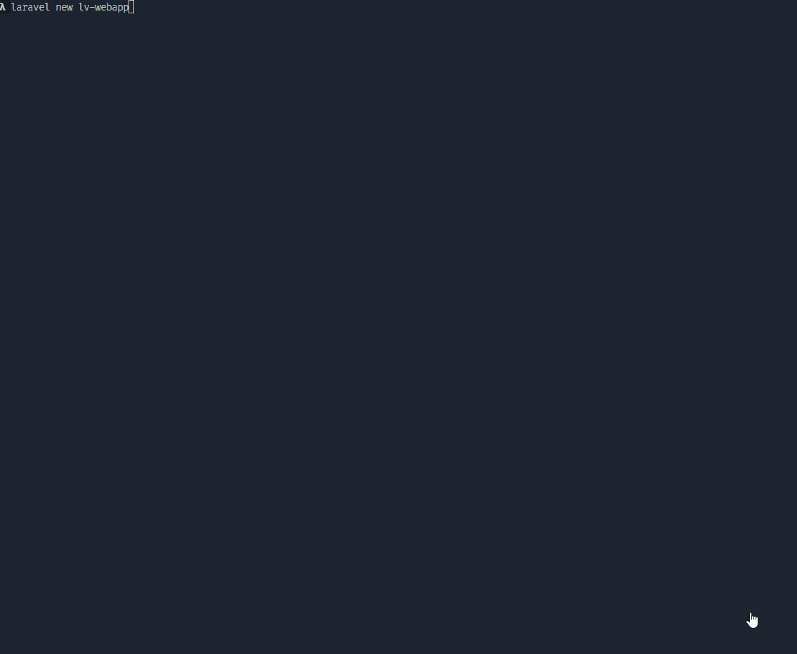
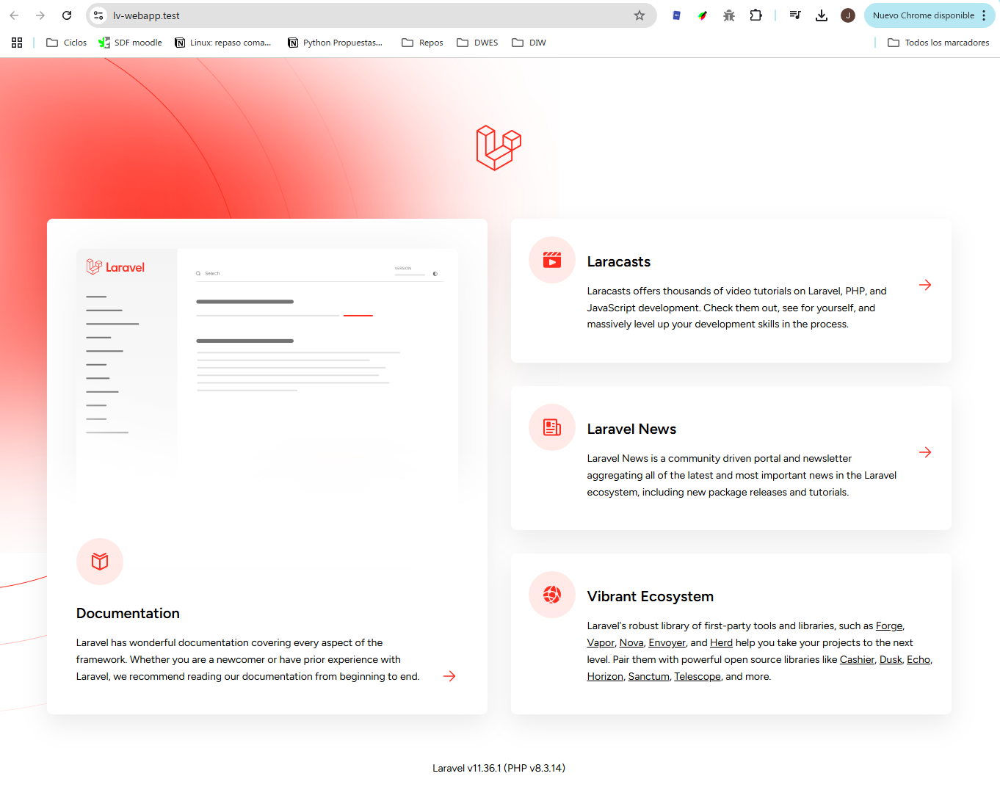
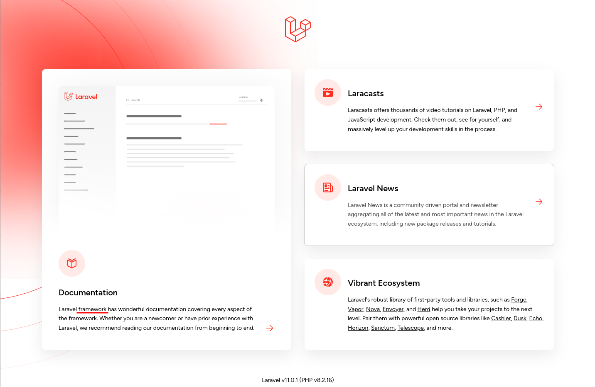
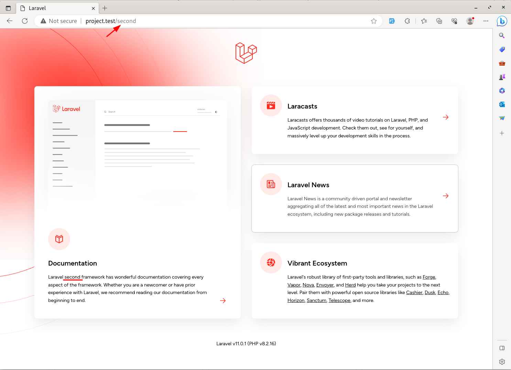
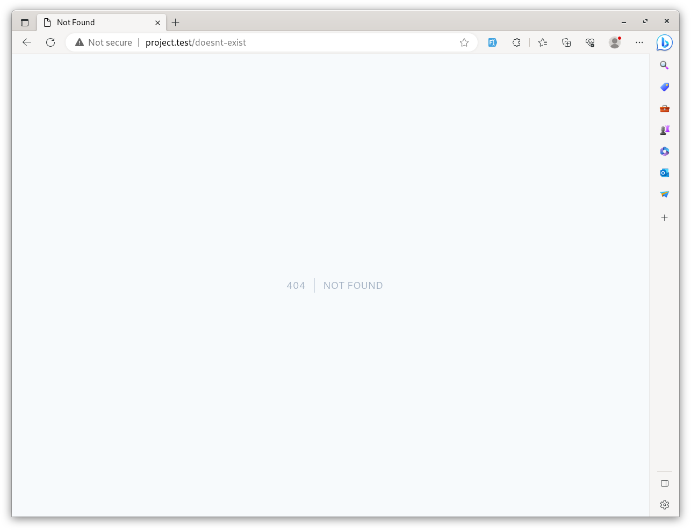

# 7.1 Instalar Laravel y primeras rutas.

En esta primera lección, crearemos un nuevo proyecto con Laravel. La [página de instalación de](https://laravel.com/docs/installation) la documentación oficial de Laravel tiene mucha información. Hay más de una forma de instalar Laravel.

La documentación oficial de Laravel se basa principalmente en una herramienta llamada [Laravel Sail](https://laravel.com/docs/sail) , que se basa en [Docker](https://www.docker.com/) . Pero no utilizaremos Sail ni docker en esta serie de tutoriales.

Mi preferencia personal es utilizar [el instalador de Laravel](https://laravel.com/docs/installation#creating-a-laravel-project) .

Pero antes de usar el instalador, necesitamos preparar su máquina.

---

## Preparación de su computadora: Composer y Web-Server

Para instalar Laravel, primero debes instalar [Composer](https://getcomposer.org/) en tu máquina. Composer se utiliza posteriormente para instalar todos los paquetes de Laravel.

A continuación, debe tener un **servidor web PHP** en su máquina. Existen diferentes herramientas "en paquete" para distintos sistemas operativos, entre las que se incluyen Nginx/Apache, PHP, MySQL y algunas otras para proyectos web PHP:

- Laravel Herd (Windows/MacOS)
- Laravel Valet (MacOS/Linux)
- Laragon/XAMPP (Windows)
- etc.

Como hemos usado en todo el curso la herramienta *Laravel Herd*, vamos a seguir con ella.

> 🔥 Laravel 11 requiere al menos la versión PHP 8.2.

Con Laravel Herd ya viene instalado Composer, PHP, MySQL,  Nginx y también el instalador de Laravel, por lo que no necesitamos instalar nada más.


## Instalar y Lanzar Laravel

Para crear un nuevo proyecto de Laravel, simplemente ejecute el siguiente comando en su terminal:

```bash
laravel new lv-webapp
```

> 📁 ¿Dónde crear el proyecto? Da igual, la ruta elegida simplemente tiene que estar agregada a Laravel Herd para que pueda crear un dominio.test para visualizar el proyecto.

Al crear un proyecto con `laravel` se iniciará un asistente donde con una serie de opciones. Seguir los pasos que se muestran en el siguiente video:

[

> *Ahora vaya a Laravel Herd, sites, y configure el nuevo sitio para aplicar seguridad HTTPS.*

Este comando creará un nuevo proyecto de Laravel en un directorio llamado `lv-webapp`. Para visualizar el proyecto, simplemente abra un navegador y vaya a `http://lv-webapp.test`.

Una vez accedemos a la URL, veremos la página de inicio de Laravel.



## Abrir proyecto en PHPStorm

Ahora que tenemos el proyecto creado, vamos a abrirlo en PHPStorm. Para ello, simplemente abrimos PHPStorm y seleccionamos la opción de abrir un proyecto o arrastramos la carpeta del proyecto al IDE.

Las rutas de Laravel se encuentran en el archivo `routes/web.php`. En este archivo se definen las rutas de la aplicación. Por ejemplo, la ruta de la página de inicio es:

```php
use Illuminate\Support\Facades\Route;
 
Route::get('/', function () {
    return view('welcome');
});
```

Tenemos una página de inicio, que lleva a una vista llamada `welcome`. Las vistas se encuentran en la carpeta `resources/views`.

Pues de una forma tan sencilla, !hemos instalado Laravel!

> ℹ️ Alguna duda? puedes ver el siguiente [video](https://laracasts.com/series/30-days-to-learn-laravel-11/episodes/1) que explica estos pasos con más detalle.


### Rutas Básicas

Dependiende de la complejidad de la aplicación, las rutas pueden ser más complejas o más sencillas. Sin simplemente se desea mostrar una página de inicio, digamos estática, sin contenido dinámico, no haría falta un controlador, y por tanto lo único necesario sería llamar a la vista directamente desde la ruta.

Para definir una ruta en Laravel, se utiliza la clase `Route` de forma estática, indicamos el `verbo http` como un método estático, utilizando 2 parámetros.

- El primero es la ruta en sí, que es un string.
- El segundo es un `closure` o función anónima que se ejecuta cuando se accede a la ruta. Esta función retornará una vista, un string, un json, etc. En este caso, retornamos una vista. Para llamar a la vista, simplemente utilizamos la función `view()` y pasamos el nombre de la vista.

```php
use Illuminate\Support\Facades\Route;

Route::get('/', function () {
    return view('welcome');
});
```

`View` es una plantilla escrita en un lenguaje específico de Laravel llamado Blade. Puedes pensar en un archivo Blade como un archivo HTML con variables en su interior.<br>
La parte `welcome` en el código significa que el archivo está en una carpeta `resources/views` con la extensión `.blade.php`. Esta extensión es crucial.
En ese archivo `welcome.blade.php`, tenemos HTML con algo de sintaxis de Blade como `@if` o `@auth`. Cambiemos un poco el texto en la vista.

Vamos a hacer un cambio en el archivo `welcome.blade.php`, cambiando el texto de la vista de inicio, como se indican a continuación:

**resources/views/welcome.blade.php**:

```php
// ...
    <p class="mt-4 text-sm/relaxed">
      // quitar
        Laravel has wonderful documentation covering every aspect of the framework. Whether you are a newcomer or have prior experience with Laravel, we recommend reading our documentation from beginning to end. 
      // añadir
        Laravel framework has wonderful documentation covering every aspect of the framework. Whether you are a newcomer or have prior experience with Laravel, we recommend reading our documentation from beginning to end. 
    </p>
// ...
```

Recarga la página en el navegador y verás el cambio en el texto.




Ahora vamos a agregar una nueva ruta:

**routes/web.php**:

```php
Route::get('/', function () {
    return view('welcome');
});

// Nueva ruta
Route::get('/second', function () { 
    return view('second');
});
```

Esto hará `project.test/second` este ruta disponible, y retornará una vista llamada `second.blade.php`, pero el problema es que si navegamos a esa ruta, veremos un error, ya que la vista `second.blade.php` no existe.

En lugar de devolver una vista, podemos devolver cualquier cosa, un string, un json, etc. Pero en este caso, devolveremos una vista.

Copia la vista `welcome.blade.php` y renómbrala a `second.blade.php`. Cambia el texto de la vista.

Si ahora accedes de nuevo, verás que ya no hay error, y la vista `second.blade.php` se muestra correctamente.



Y si visitamos una ruta que no existe, Laravel mostrará un error 404.



Así es como se crean rutas y páginas en Laravel con el lenguaje Blade.
De hecho, las páginas tendrán más lógica en proyectos reales, pero llegaremos a eso un poco más tarde. Un paso a la vez.

Pero si tienes el caso de páginas estáticas similares con solo un archivo Blade y sin mucha lógica, puedes usar una sintaxis más corta en el archivo de rutas: en lugar de Route::get() y una función de devolución de llamada, haz Route::view() y proporciona el nombre del archivo Blade como segundo parámetro.

```php
//Forma larga
Route::get('/second', function () { 
    return view('second'); 
}); 
 
//Forma corta. El método que se utiliza por defecto es GET
Route::view('/second', 'second'); 
```
!!! info "Alguna duda?"
    puedes ver el siguiente [video](https://laracasts.com/series/30-days-to-learn-laravel-11/episodes/2) que explica estos pasos con más detalle.

### ÚLTIMOS PASOS

**Generar key de la aplicación**

Laravel necesita una clave de aplicación para funcionar correctamente. Para generar una clave de aplicación, simplemente ejecute el siguiente comando en su terminal:

```bash
php artisan key:generate
```

También puede ser que la Base de Datos no existe (en caso de haber elegido SQLite como base de datos). Para crear la base de datos, simplemente ejecute el siguiente comando en su terminal:

```bash
touch database/database.sqlite
```

**Configuar .gitignore**

En nuestro caso y como estamos realizando un repositorio para trabajar en casa y en clase, vamos a quitar del `.gitignore` el archivo .env, para que podamos tener la configuración compartida entre clase y casa.

