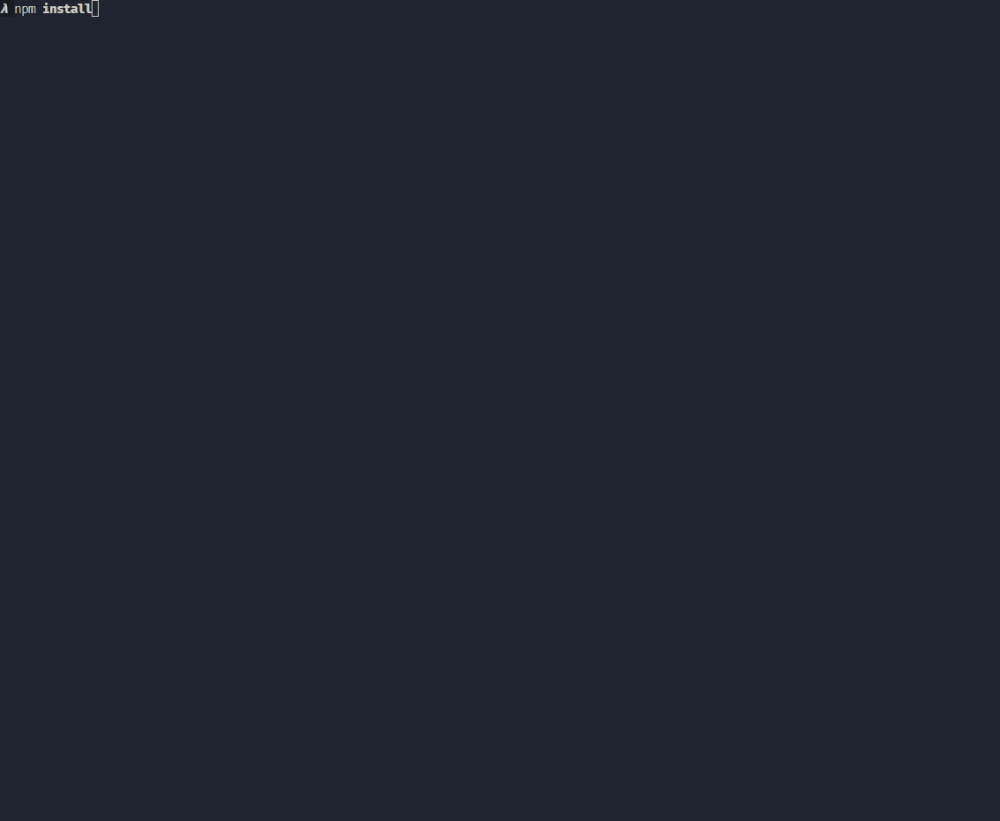

# 2. Configurar tailwind

En esta segunda lección, vamos a configurar Tailwind CSS en nuestro proyecto Laravel. Tailwind es un framework de CSS que nos permite crear estilos de forma rápida y sencilla.

### Recursos

- [Tailwind instalar con Laravel](https://tailwindcss.com/docs/guides/laravel)

---

## Configuración de Tailwind en Laravel

Si revisamos el proyecto, veremos que ya tenemos Tailwind instalado, con una serie de ficheros:

- `tailwind.config.js`: Archivo de configuración de Tailwind.
- `vite.config.js`: Archivo de configuración de Vite.

Si revisamos la guía de instalación de Tailwind en Laravel, veremos que hay que añadir una serie de configuraciones en el archivo `tailwind.config.js` vamos a ver cómo hacerlo.

> 😎 [Revisa la documentación de tailwind para Laravel](https://tailwindcss.com/docs/guides/laravel)

Si analizamos el contenido del fichero `tailwind.config.js`, veremos que hay una serie de configuraciones por defecto, como el modo de purgar, los plugins, etc.

```js
import defaultTheme from 'tailwindcss/defaultTheme';

/** @type {import('tailwindcss').Config} */
export default {
    content: [
        './vendor/laravel/framework/src/Illuminate/Pagination/resources/views/*.blade.php',
        './storage/framework/views/*.php',
        './resources/**/*.blade.php',
        './resources/**/*.js',
        './resources/**/*.vue',
    ],
    theme: {
        extend: {
            fontFamily: {
                sans: ['Figtree', ...defaultTheme.fontFamily.sans],
            },
        },
    },
    plugins: [],
};
```

En la sección `content` se definen los archivos que Tailwind debe revisar. Si te fijas, le estamos indicando la ubicación donde se encuentran las vistas de Blade, así como los archivos JS y Vue. En nuestro proyecto, no necesitamos `Vue`, por lo que podemos eliminar esa línea.

En la sección `theme`, se definen las fuentes que se van a utilizar en el proyecto. En este caso, se está utilizando la fuente `Figtree` como fuente por defecto.

Y en la parte de `plugins`, se definen los plugins que se van a utilizar en el proyecto. En este caso, no se está utilizando ningún plugin.

### Configurar archivos CSS de Tailwind en Laravel

Tailwind utiliza un archivo CSS para cargar los estilos. En nuestro proyecto, ya tenemos un archivo `app.css` que se encarga de cargar los estilos de Tailwind. Si revisamos el contenido de este archivo, veremos que se utilizan una serie de directivas de Tailwind `@tailwind base`, `@tailwind components` y `@tailwind utilities`. Estas directivas se utilizan para cargar los estilos base, los componentes y las utilidades de Tailwind.

Todo esto está ubicado dentro de la carpeta `resources/css/app.css`.

**resources/css/app.css**:

```css
@tailwind base;
@tailwind components;
@tailwind utilities;
```

### Compilar los estilos de Tailwind en Laravel

Para compilar los estilos de Tailwind en Laravel, utilizamos el comando `npm run build`. Este comando compila los estilos de Tailwind y los guarda en la carpeta `public/css/app.css`, lo que los haces disponibles en la carpeta `public` de Laravel, lo que significa que pueden ser servidos por el servidor web.

Pero antes necesitamos instalar todas las dependencias de Node, para ello ejecutamos el comando `npm install`.

```bash
npm install
```

Y por último ejecuta el comando `npm run build` para compilar los estilos de Tailwind.

```bash
npm run dev
```

#### Proceso de desarrollo

La mayoría de nuestro tiempo estaremos desarrollando el producto, por lo que no sería viable tener que hacer constantemente `npm run build` para ver nuestra app en el navegador. Para ello, también podemos utilizar `npm run dev` que compila los estilos de Tailwind y los compila, pero podemos acceder a ellos de forma local, sin necesidad de saber si estamos en producción o desarrollo.

Para ello lo único que tenemos que hacer, es utilizando la directiva de `@vite`, importar lo que necesitemos, y Vite se encarga de obtener el recurso y compilarlo (si ha cambiado) en tiempo real, obtiendolo del lugar adecuado, para nosotros debe ser nuestra ruta local, no la ruta pública.

**Cargar estilos de Tailwind en el fichero de Layout**

Para cargar los estilos de Tailwind en el fichero de layout, debemos añadir la directiva `@vite`, en la sección `head`de la página. Podemos cargar todos los recursos en una sola línea, o cargarlos de forma individual.

```php
<!DOCTYPE html>
<html lang="es">
<head>
    <meta charset="UTF-8">
    <meta name="viewport" content="width=device-width, initial-scale=1.0">
    // Cargar todos los recursos en una sola línea
    @vite(['resources/css/app.css', 'resources/js/app.js'])
    //Cargarlos en líneas separadas
    @vite('resources/css/app.css')
    @vite('resources/js/app.js')
</head>
```	

Ahora, si recargamos la página, veremos que los estilos de Tailwind se han cargado correctamente desde local, ya no es necesario cargar los estilos a través del script `<script src="https://cdn.tailwindcss.com"></script>`, lo que favorece la rápidez en la carga de la página.

**Acceder a recursos como Imágenes**

Acceder a imágenes u otros recursos también es necesario utilizar la directiva `@vite`, indicando la ruta del recurso que queremos cargar.

Las imágenes normalmente las situaremos dentro de la carpeta `resources\img`, por lo que para acceder a ellas, debemos indicar la ruta de la imagen que queremos cargar. Utilizaremos la función `Vite::asset()` para cargar la imagen, y como es contenido dinámico debe ir dentro de las llaves dobles. `{{ Vite::asset('resources/images/logo.svg') }}`.

```php
<img class="mx-auto h-12 w-auto" src="{{ Vite::asset('resources/images/logo.svg') }}"
```


**Hot reloading**

Algo fundamental en desarrollo web es no tener que estar constantemente refrescando la página para ver los cambios. Para ello, Vite nos ofrece la posibilidad de hacer hot reloading, es decir, que si hacemos un cambio en el código, automáticamente se refresca la página para ver los cambios.

Pero trabajando con Laravel Herd es más complejo, ya que tenemos en `medio` un servidor web profesional `nginx` que tiene sus restricciones. Cuando ejecutamos `npm run dev` se iinicia un servidor web local, que es el que se encarga de hacer el hot reloading, pero a ese servidor no podemos acceder, debemos acceder desde `laravel herd`. 


**Indicar en la configuración de laravel, la URL del servidor.**

En el fichero `.env` se debe indicar la URL del servidor local, para que Vite pueda acceder a él y hacer el hot reloading.

```bash
APP_URL=https://lv-webapp.test
```
Y también tenemos que indicarlo en la configuración de Vite, en el archivo `vite.config.js`.

```js
export default defineConfig({
  plugins: [
    laravel({
      // Ubicación de los recursos  
      input: ['resources/css/app.css', 'resources/js/app.js'],
      // Hot reloading
      refresh: true,
    }),
  ],
  server: {
    // URL del servidor. El puerto debe ser distinto al de Laravel
    origin: 'https://lv-webapp.test:5173',
    cors: true
  }
});
```

Ahora, si iniciamos ejecutamos `npm run dev` y accedemos a la página `https://lv-webapp.test`, y hacemos cualquier cambio en el código, veremos que la página se refresca automáticamente, sin necesidad de hacerlo manualmente. Perfecto!!


Para más información sobre cómo trabaja Vite con Laravel, revisa la [documentación](https://laravel.com/docs/11.x/vite) de Laravel.


### Recursos adicionales

- [Laravel Vite asset bundling](https://laravel.com/docs/11.x/vite)
- [Vite features](https://vite.dev/guide/features)
- 



