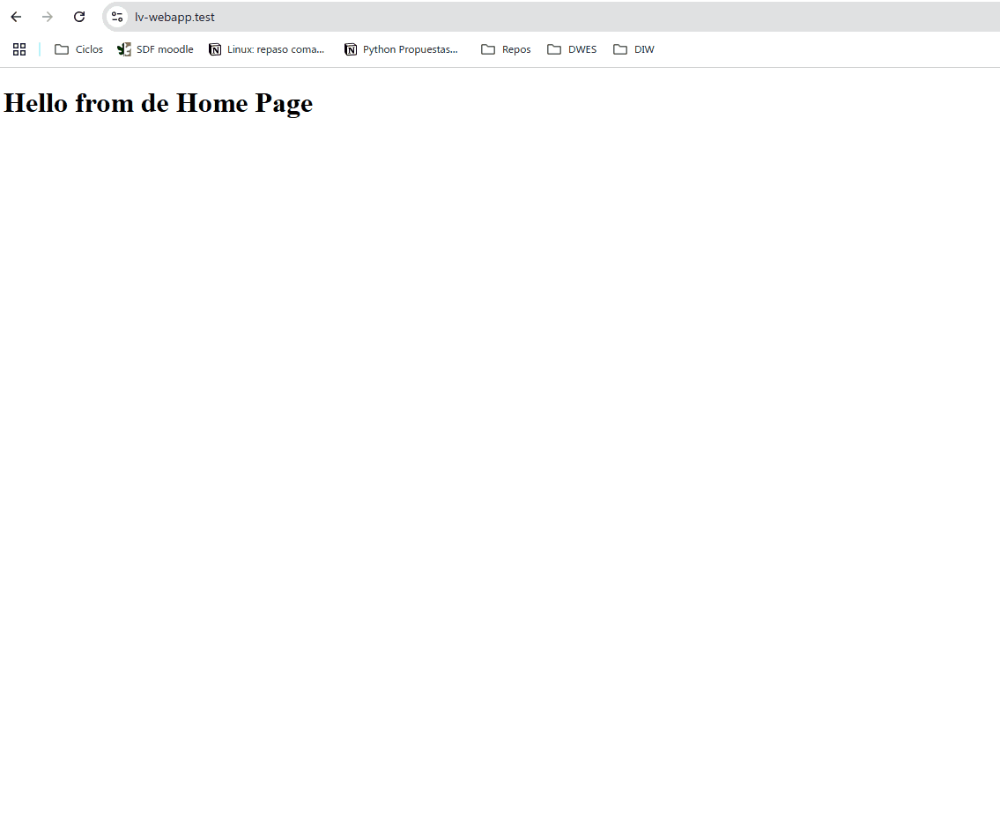
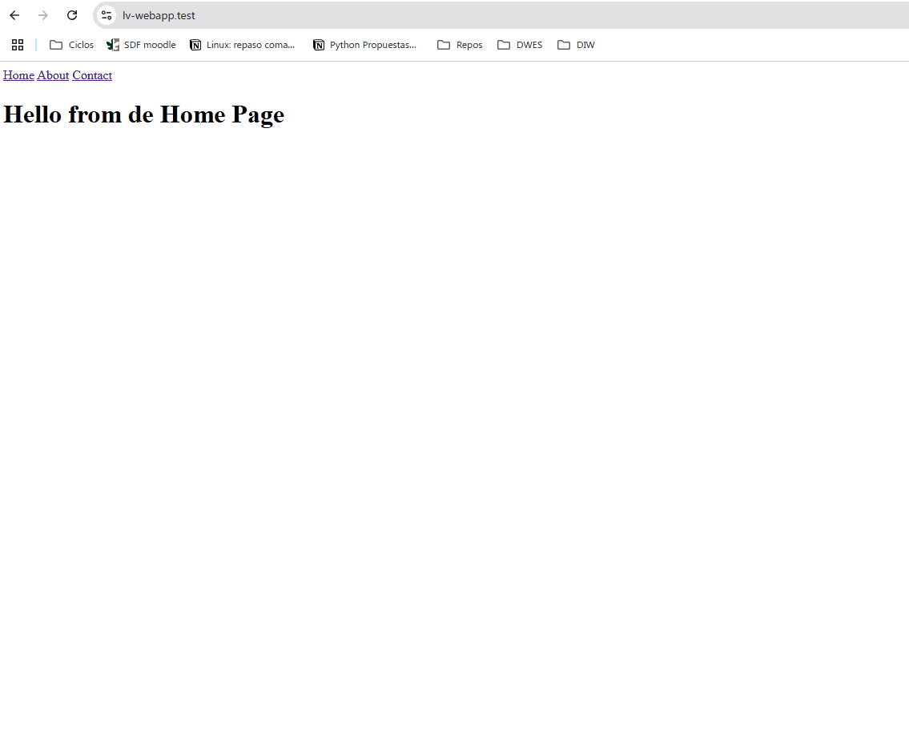

# 3. Layouts con Blade

En esta tercera lección, vamos a aprender cómo y qué son los layouts en Laravel. 

Los layouts son plantillas que se utilizan para definir la estructura de una página web. En Laravel, los layouts se crean con [Blade](https://laravel.com/docs/11.x/blade), el motor de plantillas de Laravel.

### Recursos

- [Blade Plantillas](https://laravel.com/docs/11.x/blade)

---

## Template Engine (Motor de Plantillas)

Blade es el motor de plantillas simple pero potente que se incluye con Laravel. A diferencia de algunos motores de plantillas PHP, Blade no le impide usar código PHP simple en sus plantillas. De hecho, todas las plantillas de Blade se compilan en código PHP y se almacenan en caché hasta que se modifican, lo que significa que Blade agrega esencialmente cero sobrecarga a su aplicación. Los archivos de plantilla de Blade usan la `.blade.php`extensión de archivo y generalmente se almacenan en el directorio `resources/views`.

Las vistas de Blade se pueden devolver desde rutas o controladores mediante la función asistente (helper) `view`. Por supuesto, como se menciona en la documentación sobre [vistas](https://laravel.com/docs/11.x/views).

Entraremos en más detalles sobre Blade más adelante en esta lección.


## Primeros pasos con Layouts

Antes de menternos de lleno en los layouts, vamos a ver crear algunas páginas simples, sin layouts, para entender cómo funcionan las vistas en Laravel.

En el momento actual tenemos en el proyecto, 2 vistas, `welcome.blade.php` y `second.blade.php`. Ambas vistas se encuentran en la carpeta `resources/views`.

Renombra la vista `welcome.blade.php` a `home.php`, y crear 2 vistas nuevas, `about.php` y `contact.php`.

El contenido de cada vista será muy simple, simplemente un título y un párrafo de texto.

```html
// resources/views/home.php
<!doctype html>
<html lang="en">
<head>
    <meta charset="UTF-8">
    <meta name="viewport"
          content="width=device-width, user-scalable=no, initial-scale=1.0, maximum-scale=1.0, minimum-scale=1.0">
    <meta http-equiv="X-UA-Compatible" content="ie=edge">
    <title>Home Page</title>
</head>
<body>
    <h1>Hello from de Home Page</h1>
</body>
</html>

// resources/views/about.php
<!doctype html>
<html lang="en">
<head>
    <meta charset="UTF-8">
    <meta name="viewport"
          content="width=device-width, user-scalable=no, initial-scale=1.0, maximum-scale=1.0, minimum-scale=1.0">
    <meta http-equiv="X-UA-Compatible" content="ie=edge">
    <title>About Page</title>
</head>
<body>
    <h1>Hello from de About Page</h1>
</body>
</html>

// resources/views/contact.php
<!doctype html>
<html lang="en">
<head>
    <meta charset="UTF-8">
    <meta name="viewport"
          content="width=device-width, user-scalable=no, initial-scale=1.0, maximum-scale=1.0, minimum-scale=1.0">
    <meta http-equiv="X-UA-Compatible" content="ie=edge">
    <title>Contact Page</title>
</head>
<body>
    <h1>Hello from de Contact Page</h1>
</body>
</html>
```

Ahora, vamos a crear las rutas para cada una de estas vistas. En el archivo `routes/web.php`, vamos a definir las rutas para cada una de las vistas.

```php
// routes/web.php
use Illuminate\Support\Facades\Route;

Route::get('/', function () {
    return view('home');
});

Route::get('/about', function () {
    return view('about');
});

Route::get('/contact', function () {
    return view('contact');
});
```

Si probamos ahora, veremos que si accedemos a cada una de las rutas, veremos el contenido de cada una de las vistas.



### Crear un menú de navegación

Ahora vamos a crear un menú de navegación en cada una de las vistas. Para ello, vamos a añadir un menú de navegación en cada una de las vistas.

```html
// resources/views/home.php
<!doctype html>
<html lang="en">
<head>
    <meta charset="UTF-8">
    <meta name="viewport"
          content="width=device-width, user-scalable=no, initial-scale=1.0, maximum-scale=1.0, minimum-scale=1.0">
    <meta http-equiv="X-UA-Compatible" content="ie=edge">
    <title>Home Page</title>
</head>

<body>
<nav>
    <a href="/">Home</a>
    <a href="/about">About</a>
    <a href="/contact">Contact</a>
</nav>
<h1>Hello from de Home Page</h1>
</body>
</html>
```

Agregamos este menú de navegación en las vistas `about.php` y `contact.php`. El resultado ahora quedaría así.



### Primer Layout

En vesiones anterior de Laravel, para crear un layout, se utilizaba la directiva `@extends` de Blade. A partir de la introducción de los componentes de Blade, se recomienda utilizar los componentes para crear layouts.

Los componentes de Blade deben estar dentro de la carpeta `resources/views/components`. Para crear un layout, vamos a crear un componente llamado `layout.php` dentro de la carpeta `resources/views/components`. En esta carpeta vamos a copiar el contenido de la vista `home.php`.

```html
// resources/views/components/layout.php
<!doctype html>
<html lang="en">
<head>
    <meta charset="UTF-8">
    <meta name="viewport"
          content="width=device-width, user-scalable=no, initial-scale=1.0, maximum-scale=1.0, minimum-scale=1.0">
    <meta http-equiv="X-UA-Compatible" content="ie=edge">
    <title>Home Page</title>
</head>

<body>
<nav>
    <a href="/">Home</a>
    <a href="/about">About</a>
    <a href="/contact">Contact</a>
</nav>
<h1>Hello from de Home Page</h1>
</body>
</html>
````

Ahora en `home.php`, vamos a utilizar el componente `layout.php` para crear el layout de la página.

```html
// resources/views/home.php
<x-layout>
    <h1>Hello from de Home Page</h1>
</x-layout>
```

Si ahora volvemos a refrescar la página veremos que no se muestra nada? ¿Por qué? Porque la vista se llama `home.php`, y no tiene dentro del nombre de la vista la extensión `.blade.php`, por lo que el motor de plantillas de blade no la reconoce como una vista que utilize Blade.

Para solucionarlo simplemente renombra la vista `home.php` a `home.blade.php`.

Ahora vuelve a probar y verás que el contenido de la vista `home.blade.php` se muestra bien, pero solo aparece la barra de navegación, pero no aparece el mensaje `Hello from de Home Page`. ¿Por qué? Porque no hemos dejado ningún hueco dentro del layout donde mostrar el contenido específico de cada página.

Haz lo mismo con la vista `about.php` y `contact.php`.

### Crear un slot (hueco) en el layout

Si observamos ahora en todas las páginas se muestra el mensaje `Hello from de Home Page`, pero esto no es lo que queremos, la idea es reutilizar un diseño, pero mostrando contenido específico por cada página.

**Slot**

Un `slot` es digamos como un hueco que se deja en el layout, para que la página que utilize este Layout, pueda insertar contenido específico en ese hueco.

Para ello simplemente en el componente `layout.php`, vamos a añadir un slot.

```html
// resources/views/components/layout.php
<!doctype html>
<html lang="en">
<head>
    <meta charset="UTF-8">
    <meta name="viewport"
          content="width=device-width, user-scalable=no, initial-scale=1.0, maximum-scale=1.0, minimum-scale=1.0">
    <meta http-equiv="X-UA-Compatible" content="ie=edge">
    <title>Home Page</title>
</head>

<body>
<nav>
    <a href="/">Home</a>
    <a href="/about">About</a>
    <a href="/contact">Contact</a>
</nav>

<?= $slot ?>

</body>
</html>
```

Si te fijas bien, hemos agregado debajo de la barra de navegación `<?= $slot ?>`. Esto es un slot, que es un hueco donde se va a insertar el contenido específico de cada página.

Esta sintaxis es un poco fea no? te recuerda a PHP puro, y no es muy legible. Para solucionar esto, Blade nos ofrece una sintaxis más limpia y legible. En lugar de poner `<?= $slot ?>`, podemos utilizar la directiva `{{ $slot }}`. Esas llaves dobles `{{ }}` es la forma de imprimir contenido en Blade, y es equivalente a `<?= ?>` en PHP.

Cambia ahora `<?= $slot ?>` por `{{ $slot }}`, y verás que el resultado es el mismo.

Ahora todas las páginas se verán con el contenido específico de cada página. Perfecto!!!


!!! info "Alguna duda?"
    puedes ver el siguiente [video](https://laracasts.com/series/30-days-to-learn-laravel-11/episodes/3) que explica estos pasos con más detalle.

