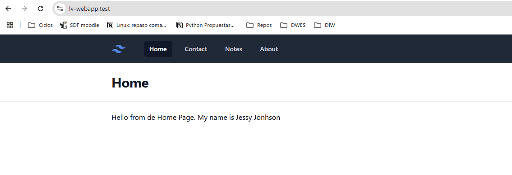
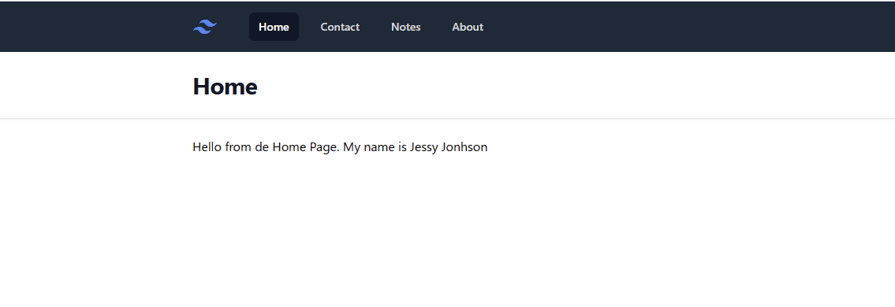
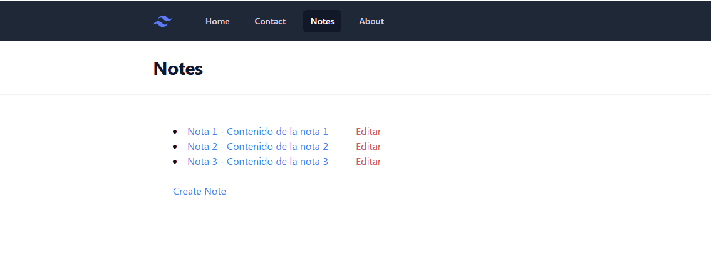

# 6. Pasar datos a la vista y rutas con Wildcards

En esta 6ª lección vamos a ver cómo podemos pasar datos a la vista y cómo podemos utilizar rutas con Wildcards.

### Recursos

---

## Pasar datos a la vista

En nuestro proyecto webapp con PHP puro, mostramos cada vista, utilizando la función `view` y pasándole el nombre de la vista (incluido la ruta relativa), y los datos se los pasábamos como un array asociativo.

Pues en Laravel se hace exactamente igutal, llamamos a la función `view` y le pasamos el nombre de la vista, y los datos se los pasamos como un array asociativo como 2º parámetro.

Vamos a ver un ejemplo.

Dentro del fichero `web.php`, y para la ruta `/` vamos a cambiar el saludo de bienvenida, en lugar de que sea fijo, vamos a pasarlo como un parámetro. Lo vamos a llamar `greating`.

```php
// routes/web.php
Route::get('/', function () {
    return view('home', [
        'greeting' => 'Hello'
        'name' => 'Jessy Johnson'
    ]);
});
```

Ahora desde la vista `home.blade.php`, vamos a utilizar las nuevos datos en el mensaje de bienvenida.

```php
// resources/views/home.blade.php
<x-layout heading="Home">
    <h1>{{$greeting ?? 'hello'}} from de Home Page. My name is {{ $name }}</h1>
</x-layout>
```

> 🤨 Utilizamos un valor por defecto para el saludo en caso de que no se pase el valor para esa variable


## Menu Notas

Si revisamos nuestra WebApp anterior teníamos una sección de notas, donde mostrábamos una lista de notas, que obteníamos de una BD, pero poco a poco, por ahora vamos a crear un menú donde poder acceder a esa sección.

Crear un nuevo menu, en el fichero `resources/views/components/layout.blade.php` y todo lo que se necesite (según hemos visto en los puntos anteriores), para que quede como se muestra en la siguiente imagen.




### Pasar datos de las Notas a la vista

Vamos a pasar datos a la vista de las notas, al final las obtendremos de Base de Datos, pero por ahora vamos a pasarlas como un array asociativo.

Si recordamos las notas, tenían un id, un título y un contenido, por lo que vamos a pasar un array de notas, donde cada nota será un array asociativo con esos 3 campos.

```php
// routes/web.php
Route::get('/notes', function () {
    return view('notes', [
        'notes' => [
            ['id' => 1, 'title' => 'Nota 1', 'content' => 'Contenido de la nota 1'],
            ['id' => 2, 'title' => 'Nota 2', 'content' => 'Contenido de la nota 2'],
            ['id' => 3, 'title' => 'Nota 3', 'content' => 'Contenido de la nota 3'],
        ]
    ]);
});
```

Ahora vamos a darle contenido a la vista de notas, y mostrar todas las notas que le pasamos en forma de lista. Para ello, simplemente copia el diseño de la vista de notas de la WebApp anterior.

> 😎 Pista: Estaba en el fichero `views\notes\index.view.php`


El resultado final es el que se muestra en la siguiente imagen.



### Mostrar el detalle de una Nota

Ahora vamos a ver cómo podemos mostrar el detalle de una nota, para ello vamos a utilizar rutas con Wildcards.

Pero ¿qué es un Wildcard? Un Wildcard es un comodín, que nos permite capturar cualquier valor en una ruta, y ese valor lo podemos utilizar en los parámetros a pasar a la vista.

Véamos un ejemplo.

Si revisamos el código del ejemplo anterior, vemos que tenemos una ruta `/notes`, pero si queremos ver el detalle de una nota, necesitamos una nueva ruta, por ejemplo `/notes/1`, `/notes/2`, `/notes/3`, etc. Y la pregunta sería, ¿crearíamos tantas rutas como Ids de notas tenemos? No, no es necesario, podemos utilizar un Wildcard.

Para ello, simplemente añadimos un `{id}` a la ruta, y ese valor lo podemos capturar en la función de devolución de llamada.

Lo que hace Laravel es revisar la ruta, y si encuentra un valor entre llaves, lo captura y lo pasa como un parámetro a la función de devolución de llamada.

Por ahora vamos a duplicar la lista de Notas, también en esta ruta, y vamos a filtrar la nota que queremos mostrar, según el id que pasamos en la ruta. Después simplemente pasamos la nota a la vista.

```php
// routes/web.php
Route::get('/notes/{id}', function ($id) {
    //Array de notas
     $notes = [
            ['id' => 1, 'title' => 'Nota 1', 'body' => 'Contenido de la nota 1'],
            ['id' => 2, 'title' => 'Nota 2', 'body' => 'Contenido de la nota 2'],
            ['id' => 3, 'title' => 'Nota 3', 'body' => 'Contenido de la nota 3']
        ];

    //Buscar la nota a través del id, utilizando las funciones de la clase Array (Collections) de Laravel Arr::first
    $note = Arr::first($notes['notes'], fn ($note) => $note['id'] == $id);

    return view('note', ['note' => $note]);
});
```

Ahora nos hace falta crear una nueva vista para mostrar el detalle de la nota, simplemente copia el diseño de la vista de detalle de la nota de la WebApp anterior. La vista se llama `show.view.php`. Duplica la vista `notes.blade.php` y renómbrala a `note.blade.php`.

> 🔥 Recuerda cambiar la ruta en `notes.blade.php` para que apunte a la nueva ruta que hemos creado para visualizar una nota.<br>
> Ahora ya no sería `href="/note/show/?id=<?= $note['id'] ?>"`, sino `href="/notes/{{ $note['id'] }}"`

El resultado final es el que se muestra en la siguiente imagen.




### Agrupar en una carpeta las vistas de Notas y renombrar las vistas a los estándares de Laravel

Para organizar mejor las vistas, vamos a crear una carpeta `notes` dentro de la carpeta `resources/views`, y vamos a mover las vistas de notas a esa carpeta.

Después vamos a renombrar las vistas a los estándares de Laravel, que es `index.blade.php` y `show.blade.php`, para mostrar la lista de notas y el detalle de una nota, respectivamente.

Ahora en el fichero `web.php`, vamos a cambiar las rutas para que apunten a las nuevas vistas.

```php
// routes/web.php
Route::get('/notes', function () {
    //Apunta a la vista index.blade.php dentro de la carpeta notes
    return view('notes.index', [
        'notes' => [
            ['id' => 1, 'title' => 'Nota 1', 'body' => 'Contenido de la nota 1'],
            ['id' => 2, 'title' => 'Nota 2', 'body' => 'Contenido de la nota 2'],
            ['id' => 3, 'title' => 'Nota 3', 'body' => 'Contenido de la nota 3']
        ]
    ]);
});

Route::get('/notes/{id}', function ($id) {
    $notes = [
        'notes' => [
            ['id' => 1, 'title' => 'Nota 1', 'body' => 'Contenido de la nota 1'],
            ['id' => 2, 'title' => 'Nota 2', 'body' => 'Contenido de la nota 2'],
            ['id' => 3, 'title' => 'Nota 3', 'body' => 'Contenido de la nota 3']
        ]
    ];

    $note = Arr::first($notes['notes'], fn ($note) => $note['id'] == $id);

    //Apunta a la vista show.blade.php dentro de la carpeta notes
    return view('notes.show', ['note' => $note]);
});
```	

En Laravel, podemos navegar por las vistas utilizando el punto `.` para indicar la ruta relativa de la vista, y así poder organizar las vistas en carpetas. También podemos utilizar la barra `/` como separador de carpetas, pero en Laravel se recomienda utilizar el punto `.`.

Ahora volvemos a probar que tras esta refactorización todo sigue funcionando igual.