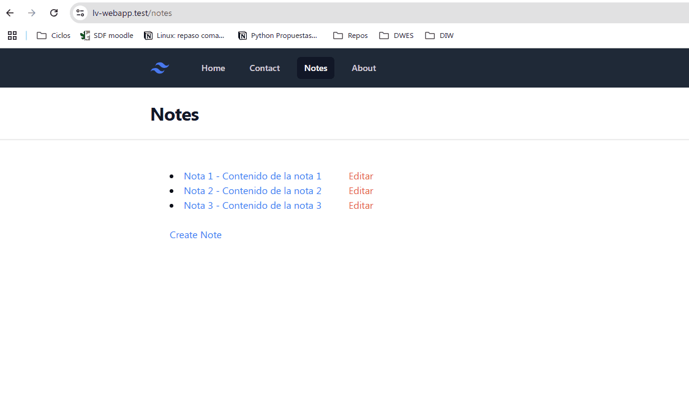

# 7. AutoLoading, Namespaces y Models

En esta 6ª lección vamos a ver cómo podemos utilizar el autoloading de clases, los namespaces y los modelos en Laravel.

### Recursos

---

## Crear un modelo

### Compartir la lista de notas

Si recordamos el punto anterior, tenemos 2 rutas, una para ver el listado de notas y otra para ver una nota, donde tenemos duplicado la lista de notas. Esto no es lo más aconsejable, por lo que vamos a solucionarlo.

Vamos a pasar la lista de notas, a un nivel superior, directamente definido en el fichero `web.php` (temporalmente).

```php
// routes/web.php
<?php

use Illuminate\Support\Arr;
use Illuminate\Support\Facades\Route;

$notes = [
        ['id' => 1, 'title' => 'Nota 1', 'body' => 'Contenido de la nota 1'],
        ['id' => 2, 'title' => 'Nota 2', 'body' => 'Contenido de la nota 2'],
        ['id' => 3, 'title' => 'Nota 3', 'body' => 'Contenido de la nota 3']
];

Route::get('/notes', function () use ($notes) {
    return view('notes.index', ['notes' => $notes]);
});

Route::get('/notes/{id}', function ($id) use ($notes) {

    $note = Arr::first($notes, fn ($note) => $note['id'] == $id);

    return view('notes.show', ['note' => $note]);
});

//resto del código
```

> 🔥🔥 Aquí se ha utilizado un concepto un poco avanzado, y es que al utilizar un `closure`, hemos tenido que usar la directiva `use ($notes)` para que la variable $notes, definida fuera de la función pueda ser utilizada dentro de la misma. 


Ahora si volvemos a probar todo debería funcionar igual que antes.

Esta solución está bien, pero podemos mejorarla.

### Crear una clase Nota

Podemos encapsular el acceso a la lista de notas a través de una clase, y que la lista de notas sea un atributo de la clase.

Vamos a crear una clase `Nota` en el mismo fichero `web.php`.

En la clase, creamos un método estático `all()` que devolverá la lista de notas. Y ahora refactorizar el código para que utilice esta clase y el método `all()`.

```php
class Notes {

    public static function all() {
        return [
            ['id' => 1, 'title' => 'Nota 1', 'body' => 'Contenido de la nota 1'],
            ['id' => 2, 'title' => 'Nota 2', 'body' => 'Contenido de la nota 2'],
            ['id' => 3, 'title' => 'Nota 3', 'body' => 'Contenido de la nota 3']
        ];
    }
}

Route::get('/notes', function () {
    return view('notes.index', ['notes' => Notes::all()]);
});

Route::get('/notes/{id}', function ($id) {
    $note = Arr::first(Notes::all(), fn ($note) => $note['id'] == $id);
    return view('notes.show', ['note' => $note]);
});
```

Aplica estos cambios y comprueba que todo sigue funcionando correctamente.

### Mover la clase al directorio correcto

Esta clase Notes, que se encarga de gestionar los datos que se van a utilizar en los procesos, y se mostrarán en las vistas es lo que se conoce como un `modelo`. Si recordamos la arquitectura MVC, el modelo es la capa que se encarga de gestionar los datos de la aplicación.

Hasta ahora hemos creado la clase `Notes` en el mismo fichero `web.php`, pero esto no es lo más correcto. En Laravel, los modelos se deben almacenar en el directorio `app/Models`.

Crea con PHPStorm una nueva clase en el directorio `app/Models` llamada `Note.php` y copia el contenido de la clase `Notes` a esta nueva clase.

> 🔥 Hemos renombrado la clase, de Notes a Note. Todos los modelos/clases deben ir en singular.

Si te fijas, verás que automáticamente PHPStorm ha añadido un `namespace` al principio de la clase. Esto es lo que se conoce como `namespace`, y es una forma de organizar las clases en directorios.

El namespaces que ha añadido PHPStorm es `App\Models`, que es el directorio donde hemos creado la clase.

**AutoLoad de Clases**

En Laravel, el autoloading de clases se realiza automáticamente, por lo que no es necesario hacer nada más para que las clases se carguen automáticamente.

Si revisamos el fichero `composer.json`, veremos que hay una sección `autoload` que se encarga de cargar las clases automáticamente.

En esta sección, existe una clave `psr-4`, y dentro de ella, una lista de todos los namespaces y su carpeta correspondiente.

```json
// composer.json
{
  //resto del código
},
 "autoload": {
        "psr-4": {
            "App\\": "app/",
            "Database\\Factories\\": "database/factories/",
            "Database\\Seeders\\": "database/seeders/"
        }
    },
```

Lo que dice este extracto de código, es que el namespace `App` se encuentra en la carpeta `app/`, y por tanto, todas las clases que tengan el namespace `App` se deben encontrar en la carpeta `app/`. Automáticamente, Laravel cargará las clases que se encuentren en esta carpeta.

**Usar el modelo Note**

Ahora que tenemos el modelo `Note` en el directorio correcto, vamos a utilizarlo en el fichero `web.php`.

Refactoriza el código, importando la clase `Note` y utilizando el método `all()`.

Prueba, y todo debería seguir funcionando correctamente.


## Mover la lógica de filtrado a la clase Note

Si revisamos el código, vemos que en la ruta `/notes/{id}`, estamos filtrando la nota que queremos mostrar, utilizando la función `Arr::first()`. Esto no es lo más correcto, ya que la lógica de filtrado debería estar en el modelo `Note`.

Vamos a añadir un nuevo método a la clase `Note` llamado `find()` que reciba un `id` y devuelva la nota correspondiente.

```php
// app/Models/Note.php
namespace App\Models;

class Note {

    public static function all() {
        return [
            ['id' => 1, 'title' => 'Nota 1', 'body' => 'Contenido de la nota 1'],
            ['id' => 2, 'title' => 'Nota 2', 'body' => 'Contenido de la nota 2'],
            ['id' => 3, 'title' => 'Nota 3', 'body' => 'Contenido de la nota 3']
        ];
    }

    public static function find($id): array {
        return Arr::first(self::all(), fn ($note) => $note['id'] == $id);
    }
}
```

Ahora, en el fichero `web.php`, refactoriza el código para que utilice el método `find()`.

Comprueba que todo sigue funcionando correctamente.

**Nota no encontrada**

¿Qué pasa si el id no existe? Laravel nos devuelve un error, ya que la función `Arr::first()` no encuentra ningún valor.

Para solucionar esto, podemos seguir la misma idea que seguimos en el proyecto WebApp, y devolver un código HTTP 404 si no se encuentra la nota.

¿Cómo podemos hacer esto en Laravel?<br>
Laravel nos proporciona una función llamada `abort()` que nos permite abortar la ejecución de la aplicación y devolver un código HTTP. 🤔 ¿Te suena de algo? Siiii... es la misma función que teníamos en el proyecto anterior... que cracks somos. Las buenas prácticas son ampliamente utilizadas.

Entonces, si no se encuentra la nota, devolvemos un código HTTP 404.

Refactoriza el código, dentro del método `find` para que devuelva un código HTTP 404 si no se encuentra la nota, utilizando la función `abort()`.

El resultado final se muestra en la siguiente imagen.

