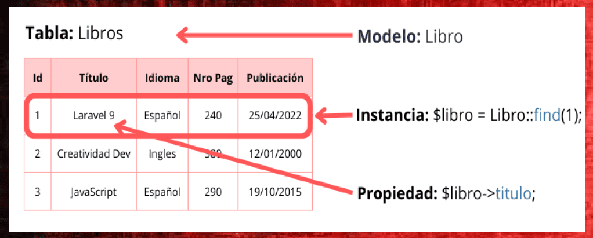

# 9. Introducción a Eloquet ORM

En esta 8ª lección vamos a conocer a Eloquent, el ORM de Laravel, que nos permite interactuar con la base de datos de una forma sencilla y elegante.

### Recursos

- [Documentación oficial de Eloquent](https://laravel.com/docs/11.x/eloquent)

---

## ORM

Un ORM (Object-Relational Mapping) es una técnica de programación que permite eliminar la disparidad entre el modelo de datos de una base de datos relacional y el modelo de objetos de una aplicación. Mientras que en una BD de datos pensamos en tablas y campos, en el mundo de desarrollo pensamos en objetos y propiedades.

Las ventajas que presenta un ORM:

- **Abstracción de la base de datos**: No es necesario escribir SQL, ya que el ORM se encarga de traducir las operaciones de la base de datos a objetos.
- **Nombres de campos y tablas**: No es necesario recordar los nombres de las tablas y campos, ya que el ORM se encarga de ello. Si cambiamos el nombre de un campo, solo tenemos que cambiarlo en un lugar, en el modelo.
- **Relaciones**: Las relaciones entre tablas se pueden definir en los modelos, y el ORM se encarga de gestionarlas. Atravesar relaciones es tan sencillo como acceder a una propiedad de un objeto.
- **Mundo de objetos**: Todo son objetos y no es necesario pensar en tablas y campos.


## Eloquent ORM

Eloquent es el ORM de Laravel, y nos permite interactuar con la base de datos de una forma sencilla y elegante. Eloquent es una implementación del patrón `Active Record`, que es un patrón de diseño que combina la lógica de negocio y la lógica de acceso a datos en un solo objeto.

Eloquent es una capa de abstracción de la base de datos, que nos permite interactuar con la base de datos utilizando objetos. Cada tabla de la base de datos tiene un modelo asociado, que es una clase que representa a la tabla.

*Todas las tablas, son modelos, y todos los registros de la tabla, son instancias de ese modelo.*

En la siguiente imagen, se muestra la relación entre una tabla de la base de datos y un modelo de Eloquent.



**Modelos en Laravel**

Los Modelos son uno de los componentes más importantes de Laravel, son los responsables de interactuar con nuestra base de datos de una manera orientada a objetos. Los modelos representan las tablas de la base de datos como clases en la aplicación, permiten realizar operaciones para seleccionar, crear, actualizar y eliminar datos de una manera más sencilla y estructurada.


## Crear un Modelo

Para crear un modelo en Laravel, simplemente ejecutamos el siguiente comando en la terminal:

```bash
php artisan make:model Note
```

> 🔥 Importante: Todos los modelos deben ir en singular.

El comando crea una archivo Note.php” en la carpeta app/Models, si abrimos el archivo veremos que tiene una clase “Note.php” que se extiende de la clase “Models”, esto nos permitirá manipular los registros de la base de datos como objetos.

Por defecto, la tabla y el nombre de la clase deben llamarse igual, en este caso, la tabla se llamará “notes” y la clase “Note”. Si queremos cambiar este comportamiento, simplemente debemos añadir una propiedad protegida en el modelo llamada “table” y asignarle el nombre de la tabla. Por ejemplo, si la tabla se llama “notas”, la propiedad sería: `protected $table = 'notas';`.

Normalmente, cuando creamos un modelo también vamos a necesitar más elementos, como una migración para crear la tabla en la base de datos, un controlador para gestionar las peticiones, y una vista para mostrar los datos. Laravel nos permite crear todos estos elementos de una sola vez, simplemente añadiendo las opciones al comando.

Las opciones que podemos añadir son:

- `--all`: Crea un controlador, una migración y una vista.
- `--controller`: Crea un controlador.
- `--migration`: Crea una migración.
- `--resource`: Crea un controlador y una vista.
- `--factory`: Crea un factory.
- `--seed`: Crea un seeder.
- `--pivot`: Crea una tabla pivote.

También existen estas opciones en versión corta:

- `-a`: Crea un controlador, una migración y una vista.
- `-c`: Crea un controlador.
- `-m`: Crea una migración.
- `-r`: Crea un controlador y una vista.
- `-f`: Crea un factory.
- `-s`: Crea un seeder.
- `-p`: Crea una tabla pivote.

Todas estas opciones y su aplicación las veremos en las próximas lecciones.


## Modelo Note

Si revisamos nuestro código, ya tenemos una clase `Note` en el directorio `app/Models`, que almacenada de forma estática un array de notas.

¿Cómo podemos convertir esta clase en un modelo de Eloquent? 🤔<br>
Nada más fácil, simplemente tenemos que extender la clase `Model` de Eloquent.

Al extender la clase `Model`, Eloquent nos proporciona una serie de métodos que nos permiten interactuar con la base de datos de una forma sencilla y elegante. Y en nuestro caso, como ya teníamos un método `all()` PHPStorm nos ha añadido un aviso de error, ya que el método `all()` ya existe en la clase `Model`, pero posee diferentes parámetros, por lo que debemos eliminarlo.

Eliminamos el método `all()` y `find()` de la clase `Note`, ya que estos métodos ya existen en la clase `Model` de Eloquent.

```php
namespace App\Models\Note;

class Note extends Model {

}
```

Ahora, tendremos que crear alguna nota, ya que la tabla está vacía. Para ello, crea varios registros en la tabla `notes` de la base de datos, y refresca la página de notas. Verás que por arte de mágia se visualizan todas las notas que has creado.

### Objeto no array asociativo

Ahora una nota no es un array asociativo, sino un objeto de la clase `Note`. Por lo que en la vista de notas, debemos cambiar la forma de acceder a los campos de la nota. Eloquent, nos permite acceder de ambas formas, como claves de un array o como propiedades, pero es recomendable utilizar propiedades.

En la vista, `show.blade.php`, cambia la forma de acceder a los campos de la nota, de `$note['id']` a `$note->id`, y de `$note['title']` a `$note->title`.

Aplica este cambio, y comprueba que todo sigue funcionando correctamente.


## Tinker

Tinker es una herramienta de Laravel que nos permite interactuar con la aplicación desde la consola. Tinker nos permite interactuar con la base de datos, ejecutar comandos de Artisan, y probar código PHP. Es un **playground** para probar cosas en Laravel.

Para abrir Tinker, simplemente ejecutamos el siguiente comando en la terminal:

```bash
php artisan tinker
```

Una vez abierto Tinker, podemos ejecutar cualquier comando de PHP, como si estuviéramos en un script PHP. Por ejemplo, podemos crear una nueva nota, y guardarla en la base de datos.

```php
$note = new App\Models\Note;

$note->title = 'Nota 4';
$note->body = 'Contenido de la nota 4';

$note->save();
```
Esto creará una nueva nota en BD, con el título y el contenido que hemos indicado.

También es posible, crear una nota desde el método `create()` de la clase `Note`.

```php
$note = App\Models\Note::create([
    'title' => 'Nota 5',
    'body' => 'Contenido de la nota 5'
]);
```

> 🔥 Importante: El método `create()` solo funciona si tenemos definidos los campos `fillable` en el modelo.<br>
> Por lo que debemos añadir un array `fillable` en el modelo `Note`, con los campos que queremos que se puedan rellenar de forma masiva.

```php
protected $fillable = ['title', 'body'];
```

También es posible, recuperar todas las notas de la base de datos, o buscar una nota por su id.

```php
$notes = App\Models\Note::all();

$note = App\Models\Note::find(1);
```

Tinker es una herramienta super potente, que nos permite interactuar con la aplicación de una forma sencilla y rápida. Es muy útil para probar cosas, y para depurar la aplicación.

También es posible eliminar una nota de la base de datos, simplemente llamando al método `delete()` de la instancia de la nota.

```php
$note->delete();
```

## Crear un Modelo desde la consola

Es posible crear un modelo desde la consola, simplemente ejecutando el siguiente comando:

```bash
php artisan make:model Note
```
Aunque también existen una serie de opciones que podemos añadir al comando, para crear otros elementos relacionados con el modelo.

- `-c, --controller`: Crea un controlador.
- `-m, --migration`: Crea una migración.
- `-r, --resource`: Crea un controlador y una vista.
- `-f, --factory`: Crea un factory.
- `-s, --seed`: Crea un seeder.
- `-a, --all`: Crea un controlador, una migración y una vista.

Así que si queremos crear un modelo, una migración y un controlador, simplemente ejecutamos el siguiente comando:

```bash
php artisan make:model Note -cm
```

En próximos capítulos veremos estas opciones de crear un modelo con más elementos, como una migración y un controlador.

!!! info "Alguna duda?"
    puedes ver el siguiente [video](https://laracasts.com/series/30-days-to-learn-laravel-11/episodes/9) que explica estos pasos con más detalle.
