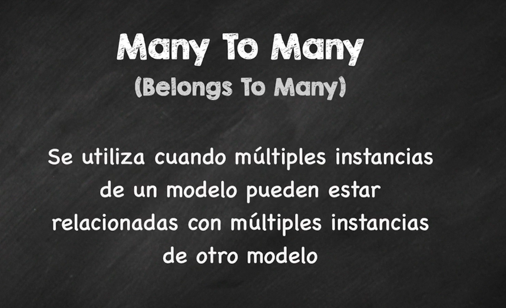
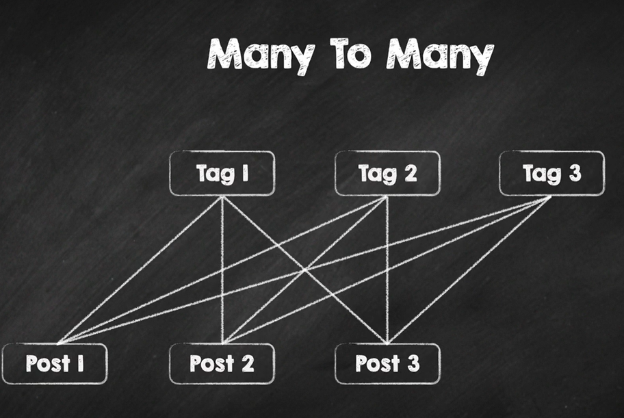
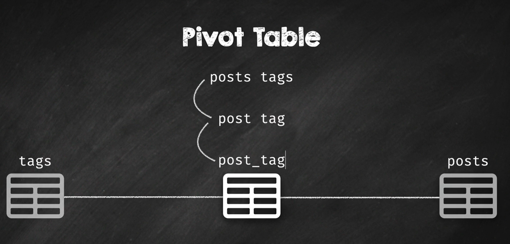
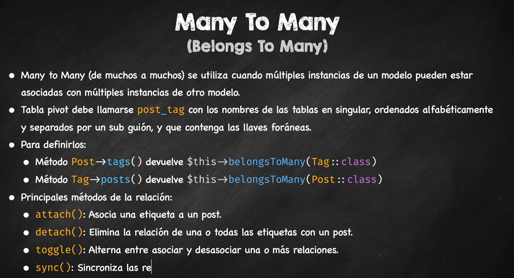

# 12. Eloquent: Relación Many to Many

En esta 12ª lección vamos a ver cómo podemos utilizar las relaciones `Many to Many` en Eloquent, para relacionar los modelos entre sí.

### Recursos

- [Eloquent Relación Many-to-many](https://laravel.com/docs/11.x/eloquent-relationships#many-to-many)

---

## Relación Many to Many

Una relación `Many to Many` es una relación donde varios registros de una tabla se relacionan con varios registros de otra tabla.

Por ejemplo, en una aplicación de música, un `Album` puede tener varios `Artistas`, y un `Artista` puede tener varios `Albums`. En estas relaciones, es necesario una tabla intermedia que relacione los `Albums` con los `Artistas`. Esta tabla intermedia se llama tabla `pivot`.

En Eloquent, para definir una relación `Many to Many`, necesitamos definir 2 métodos en los modelos que representan la relación. Un método en el modelo `Album`, y otro método en el modelo `Artista`. Además, necesitamos definir la tabla `pivot` que relaciona los `Albums` con los `Artistas`. 




Otro ejemplo muy común, es un Post que puede tener varios Tags, y un Tag puede tener varios Posts. 



La convención de nombres para la tabla pivot es el nombre de los modelos en orden alfabético en singular, separados por guiones bajos. Por ejemplo, si tenemos los modelos `Album` y `Artista`, la tabla pivot se llamará `album_artista`, para el caso de los modelos `Post` y `Tag`, la tabla pivot se llamará `post_tag`.




> 💡 Es muy recomendable siempre hacerlo en inglés y en singular, y respectando las reglas gramiticales de los plurales e irregulares, para no tener que hacer ninguna configuración adicional.


## Crear una relación Many to Many

En nuestro ejemplo de Notas, vamos a crear una relación `Many to Many` entre las tablas `notes` y `tags`. Una nota puede tener varios tags, y un tag puede tener varias notas. Para ello, necesitamos una tabla intermedia `note_tag` que relacione las notas con los tags.

Por tanto, lo primero que necestiamos crear es el modelo `Tag` y además vamos a crear en el mismo comando la migración y el factory.

```bash
php artisan make:model Tag -mf
```

**Crear la tabla Tag**

Si revisams veremos una migraccion `create_tags_table.php` en la carpeta `database/migrations`, que contiene el siguiente código:

La tabla `tags` tiene 2 campos, `id` y `name`.

```php
/**
 * Run the migrations.
 */
public function up(): void
{
    Schema::create('tags', function (Blueprint $table) {
        $table->id();
        $table->string('name')->unique();
        $table->timestamps();
    });
}

/**
 * Reverse the migrations.
 */
public function down(): void
{
    Schema::dropIfExists('tags');
}
```

Tenemos la tabla `tags` y la tabla `notes`, ahora necesitamos una tabla intermedia que conecte ambas tablas. La tabla intermediaria se llamará `note_tag`. En esta tabla, necesitamos al menos 2 campos, los identificadores de las tablas relacionadas, `note_id` y `tag_id`. Además si queremos controlar cuando se actualizan estos campos, podemos agregar campos de tiempo, `created_at` y `updated_at`.

Modificamos la migración para incluir la tabla `note_tag`.

```php
/**
 * Run the migrations.
 */
public function up(): void
{
    Schema::create('tags', function (Blueprint $table) {
        $table->id();
        $table->string('name');
        $table->timestamps();
    });

     Schema::create('note_tag', function (Blueprint $table) {
            $table->id();
            $table->foreignIdFor(Note::class);
            $table->foreignIdFor(Tag::class);
            $table->timestamps();
        });
}

/**
 * Reverse the migrations.
 */
public function down(): void
{
    Schema::dropIfExists('note_tag');
    Schema::dropIfExists('tags');
}
```

Ahora, ejecutamos la migración para crear las tablas.

```bash
php artisan migrate
```

Si revisamos la base de datos, veremos que se han creado las tablas `tags` y `note_tag`.

### Aplicar eliminación en cascada

En las tablas intermedias, es posible que queramos aplicar eliminación en cascada, para que cuando se elimine un registro de una tabla, se eliminen automáticamente los registros relacionados en la tabla intermedia.

Para ello, podemos modificar la migración de la tabla intermedia, y añadir las claves foráneas con la opción `onDelete('cascade')`.

```php
/**
 * Run the migrations.
 */
public function up(): void
{
    Schema::create('tags', function (Blueprint $table) {
        $table->id();
        $table->string('name');
        $table->timestamps();
    });

     Schema::create('note_tag', function (Blueprint $table) {
            $table->id();
            //Eliminar en cascada cuando se elimina una nota
            $table->foreignIdFor(\App\Models\Note::class)->constrained()->cascadeOnDelete();
            //Eliminar en cascada cuando se elimina un tag
            $table->foreignIdFor(\App\Models\Tag::class)->constrained()->cascadeOnDelete();
            $table->timestamps();
        });
}

/**
 * Reverse the migrations.
 */
public function down(): void
{
    Schema::dropIfExists('note_tag');
    Schema::dropIfExists('tags');
}
```

Normalmente, en este tipo de tablas intermedias, no se permite repetir las combinaciones de claves foráneas, por lo que podemos añadir una clave única para evitar duplicados. Para ello utilizamos el método `unique(['note_id', 'tag_id'])`, o si no queremos tener una campo id, podemos utilizar esta clave como clave primaria.

Un ejemplo de esto sería el siguiente:

```php
/**
 * Run the migrations.
 */
public function up(): void

{
    Schema::create('tags', function (Blueprint $table) {
        $table->id();
        $table->string('name');
        $table->timestamps();
    });

    //Opción 1: Clave única
    Schema::create('note_tag', function (Blueprint $table) {
        $table->id();
        $table->foreignIdFor(\App\Models\Note::class)->constrained()->cascadeOnDelete();
        $table->foreignIdFor(\App\Models\Tag::class)->constrained()->cascadeOnDelete();
        $table->unique(['note_id', 'tag_id']);
        $table->timestamps();
    });

    //Opción 2: Clave primaria
    Schema::create('note_tag', function (Blueprint $table) {
        $table->foreignIdFor(\App\Models\Note::class)->constrained()->cascadeOnDelete();
        $table->foreignIdFor(\App\Models\Tag::class)->constrained()->cascadeOnDelete();
        $table->primary(['note_id', 'tag_id']);
        $table->timestamps();
    });
}
```	

En nuestro caso vamos a optar por la opción 1, y añadir una clave única a la tabla `note_tag`, quedando así la migración:

```php
public function up(): void

{
    Schema::create('tags', function (Blueprint $table) {
        $table->id();
        $table->string('name');
        $table->timestamps();
    });

    //Opción 1: Clave única
    Schema::create('note_tag', function (Blueprint $table) {
        $table->id();
        $table->foreignIdFor(\App\Models\Note::class)->constrained()->cascadeOnDelete();
        $table->foreignIdFor(\App\Models\Tag::class)->constrained()->cascadeOnDelete();
        $table->unique(['note_id', 'tag_id']);
        $table->timestamps();
    });
}
```


Para volver a re-aplicar la migración, hacemos primero un rollback y luego volvemos a ejecutar la migración.

```bash
php artisan migrate:rollback
php artisan migrate
```

> 💡 Por defecto, en SQLite, las restricciones de clave foránea no están activadas por defecto. Para activarlas ejecutar el comando `PRAGMA foreign_keys=on`


## Definir la relación Many to Many

Ahora que tenemos las tablas `notes`, `tags` y `note_tag`, vamos a definir la relación `Many to Many` en los modelos `Note` y `Tag`.

Una nota puede tener varios tags, y un tag puede tener varias notas. Por tanto, en el modelo `Note`, vamos a definir un método `tags()` que devuelva todos los tags de una nota.

La relación `Many to Many` en Eloquent se define con el método `belongsToMany()`. Tenemos que definir en ámbos modelos la relación, en el modelo `Note` y en el modelo `Tag`.

Una Nota tendrá varios Tags, y un Tag tendrá varias Notas.

```php
// app/Models/Note.php
class Note extends Model {

    use HasFactory;

    protected $fillable = ['title', 'body'];

    public function user(): BelongsTo {
        return $this->belongsTo(User::class);
    }

    public function tags(): BelongsToMany {
        return $this->belongsToMany(Tag::class);
    }

}

// app/Models/Tag.php
class Tag extends Model
{
    use HasFactory;
    
    public function notes(): BelongsToMany {
        return $this->belongsToMany(Note::class);
    }
}
```

## Agregar Elementos a la tabla pivot

Para añadir elementos a la tabla pivot, utilizamos el método `attach()`. Este método recibe el identificador del modelo relacionado, o la instancia del modelo relacionado.

Vamos a trabajar con ello primero desde Tinker.

```bash
php artisan tinker
```

```php
use App\Models\Note;
use App\Models\Tag;

$note = Note::find(1);
//Crear varios tags
$tag1 = Tag::firstOrCreate(['name' => 'Laravel']);
$tag2 = Tag::firstOrCreate(['name' => 'PHP']);
$tag3 = Tag::firstOrCreate(['name' => 'Eloquent']);

//Añadir un tag a una nota
$note->tags()->attach($tag1); //devuelve null

//Si ejecutamos este comando nuevamente, dará un error, ya que no se pueden repetir las combinaciones
$note->tags()->attach($tag1); //ERROR

//Añadir varios tags a una nota
$note->tags()->attach([$tag2->id, $tag3->id]);

//Eliminar un tag de una nota
$note->tags()->detach($tag1);

//o a través del id
$note->tags()->detach($tag2->id);

//Para acceder a los tags de una nota
$note->tags;  //sin paréntesis como si fuera una propiedad
```

Si ejecutamos el comando `$note->tags`, veremos que nos devuelve una sola Tag, ¿por qué?, porque hemos obtenido la Nota con el id 1, y posteriormente hemos agregado elementos a la relación, pero no hemos vuelto a obtener la Nota, por lo que no se han refrescado los datos.

Para refrescar los datos, podemos hacer un `refresh()`.

```php
$note->refresh();

$note->tags;
= Illuminate\Database\Eloquent\Collection {#6222
    all: [
      App\Models\Tag {#6398
        id: 1,
        name: "Laravel",
        created_at: "2024-12-25 13:22:04",
        updated_at: "2024-12-25 13:22:04",
        pivot: Illuminate\Database\Eloquent\Relations\Pivot {#6262
          note_id: 1,
          tag_id: 1,
        },
      },
      App\Models\Tag {#6395
        id: 2,
        name: "PHP",
        created_at: "2024-12-25 13:22:18",
        updated_at: "2024-12-25 13:22:18",
        pivot: Illuminate\Database\Eloquent\Relations\Pivot {#6399
          note_id: 1,
          tag_id: 2,
        },
      },
      App\Models\Tag {#6394
        id: 3,
        name: "Eloquent",
        created_at: "2024-12-25 13:26:45",
        updated_at: "2024-12-25 13:26:45",
        pivot: Illuminate\Database\Eloquent\Relations\Pivot {#6400
          note_id: 1,
          tag_id: 3,
        },
      },
    ],
  }
```

Ahora sí, vemos que tenemos los 3 tags asociados a la nota.

### Método Toggle

Otro método que podemos utilizar para añadir o eliminar elementos de la tabla pivot, es el método `toggle()`. Este método añade un elemento si no existe, y lo elimina si ya existe. Es muy útil cuando queremos asociar o desasociar elementos de una relación. 

```php
//Añadir o eliminar un tag de una nota.
$note->tags()->toggle($tag1);

//Añadir o eliminar varios tags de una nota.
$note->tags()->toggle([$tag2->id, $tag3->id]);

//Devuelve un array con 2 claves, attached y detached, con los elementos añadidos y eliminados.
//En este caso, se han eliminado los tags 1 y 2.
= [
    "attached" => [],
    "detached" => [
      1,
      2,
    ],
  ]

//Si volvemos a ejecutar el comando, se añadirán los tags 1 y 2.
$note->tags()->toggle([$tag2->id, $tag3->id]);
= [
    "attached" => [
      1,
      2,
    ],
    "detached" => [],
  ]
```

### Método Sync

El método `sync()` nos permite sincronizar los elementos de la tabla pivot. Este método recibe un id/instancia o un array de ids/instancias, y elimina los elementos que no estén en el array. Es decir, solo deja los elementos que le pasamos en el array.

```php
//Solo deja los tags 2 y 3, y elimina el resto de tags asociados a la nota.
$note->tags()->toggle([1,3]);
```	

### Método SyncWithoutDetaching

El método `syncWithoutDetaching()` es similar al método `sync()`, pero no elimina los elementos que no están en el array. Es decir, añade los elementos que le pasamos en el array, y mantiene los elementos que ya estaban asociados.

```php
//Añade los tags 1 y 3,
$note->tags()->sync([1,3]);

//Si queremos añadir el tag-1 y el tag-2, pero no borrar el resto de tags que tuviera.
$note->tags()->syncWithoutDetaching([1,2]);
```

Es útil, cuando queremos añadir elementos a una relación, pero no queremos eliminar los elementos que ya están asociados.


### Activar los timestamps en la tabla pivot

Por defecto, las tablas pivot no tienen activados los campos `created_at` y `updated_at`. Si queremos activar estos campos, podemos hacerlo a través del método `withTimestamps()`.

```php
// app/Models/Note.php
class Note extends Model {

    use HasFactory;

    protected $fillable = ['title', 'body'];

    public function user(): BelongsTo {
        return $this->belongsTo(User::class);
    }

    public function tags(): BelongsToMany {
        return $this->belongsToMany(Tag::class)->withTimestamps();
    }
}

// app/Models/Tag.php
class Tag extends Model
{
    use HasFactory;

    protected $fillable = ['name'];

    public function notes(): BelongsToMany {
        return $this->belongsToMany(Note::class)->withTimestamps()
    }
}
```

Para la relación inversa, entre el modelo `Tag` y el modelo `Note`, también podemos activar los timestamps en la relación entre Tags y Notes.


## Almacenar datos adicionales en la tabla pivot

A veces es necesario almacenar información adicional en la tabla intermediaria, además de los identificadores de las tablas relacionadas. Por ejemplo, en una relación entre `Albums` y `Artistas`, podemos querer almacenar la fecha en la que se lanzó el álbum, o el número de canciones que tiene el álbum.

En nuestro caso queremos saber la fecha en la que se añadió un tag a una nota, por lo que necesitamos añadir un campo `added_at` a la tabla `note_tag`. (se podría conocer por el campo `created_at` de la tabla pivot, pero vamos a añadirlo para ver cómo se hace).

Para ello, necesitamos modificar la migración de la tabla `note_tag`, y añadir el campo `added_at`.

```php
/**
 * Run the migrations.
 */
public function up(): void

{
    Schema::create('tags', function (Blueprint $table) {
        $table->id();
        $table->string('name');
        $table->timestamps();
    });

    //Opción 1: Clave única
    Schema::create('note_tag', function (Blueprint $table) {
        $table->id();
        $table->foreignIdFor(\App\Models\Note::class)->constrained()->cascadeOnDelete();
        $table->foreignIdFor(\App\Models\Tag::class)->constrained()->cascadeOnDelete();

        //Añadir el campo added_at
        $table->timestamp('added_at')->nullable();

        $table->unique(['note_id', 'tag_id']);
        $table->timestamps();
    });
}
```	

Para reaplicar la migración, hacemos un rollback y volvemos a ejecutar la migración.

```bash
php artisan migrate:rollback && php artisan migrate
```

Ahora si queremos agregar este campo a la tabla pivot, necesitamos modificar el método `attach()` y añadir el campo `added_at`.

```php
// app/Models/Note.php
class Note extends Model {

    use HasFactory;

    protected $fillable = ['title', 'body'];

    public function user(): BelongsTo {
        return $this->belongsTo(User::class);
    }

    public function tags(): BelongsToMany {
        //Devemos indicar el campo added_at en la relación si lo queremos obtener
        return $this->belongsToMany(Tag::class)->withTimestamps()
        ->withPivot('added_at');
    }
}
```

Si queremos añadir un tag a una nota, y además añadir la fecha en la que se añadió, podemos hacerlo de la siguiente forma:

```php
$note->tags()->attach($tag1, ['added_at' => now()]);
```

La información adicional, se necesita pasar un array con toda la información `extra` que se quiere añadir.


## En resumen

En esta lección hemos visto cómo podemos utilizar las relaciones `Many to Many` en Eloquent, para relacionar los modelos entre sí.




