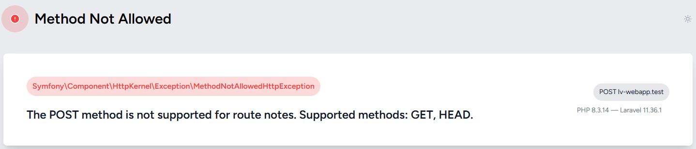

# 15. Forms y CSRF explicado

En esta 15ª lección vamos a ver cómo proteger nuestras aplicaciones de Laravel contra ataques CSRF, y cómo crear formularios en Laravel.

### Recursos

- [CRSF Laravel](https://laravel.com/docs/11.x/csrf#main-content)

---

## Formularios en Laravel

Por fin llegamos a la parte más interesante, la creación de formularios en Laravel. Laravel nos facilita la creación de formularios, y nos protege contra ataques CSRF.

Si recordamos, en nuestra aplicación anterior `webapp`, teníamos una serie de rutas para tratar con cada recurso, vamos a repasarlas.

- `GET /posts` - Listado de todos los posts
- `GET /posts/show` - mostrar de un post
- `GET /posts/edit` - editar de un post
- `GET /posts/create` - Formulario para crear un post
- `POST /posts` - Crear un post
- `PATCH /posts` - Actualizar un post
- `DELETE /posts` - Eliminar un post

Con esta aproximación, los IDs de los posts se pasan a través de la URL, de la siguiente forma:

- `GET /posts/show?id=1` - Mostrar el post con ID 1
- `GET /posts/edit?id=1` - Editar el post con ID 1
- `DELETE /posts` - Eliminar el post con ID 1 (el ID se pasa a través de un formulario)
- `PATCH /posts` - Actualizar el post con ID 1 (el ID se pasa a través de un formulario)


Laravel utiliza una aproximación diferente, donde los IDs de los recursos se pasan a través de la URL, y no a través de los formularios. Por ejemplo, para mostrar un post, Laravel utiliza la siguiente URL:

- `GET /posts/1` - Mostrar el post con ID 1
- `GET /posts/1/edit` - Editar el post con ID 1
- `DELETE /posts/1` - Eliminar el post con ID 1

Estas son para el post con ID 1, pero claro sería imposible tener una ruta para cada post diferente, por lo que laravel utiliza los llamados `wildcards` para capturar el ID del post. Por ejemplo, la ruta para mostrar un post sería. Estos wildcards se definen entre `{} y en su interior el nombre de la variable que queremos capturar. Este valor Laravel lo convierte en una variable que podemos utilizar en nuestro controlador.

Así de esta forma, Laravel nos hace el trabajo más complicado, de obtener captura el ID de la URL, y lo pasa a nuestro controlador.

Así las rutas se podrían simplificar de la siguiente forma:

- `GET /posts` - Mostrar todos los posts
- `GET /posts/create` - Mostrar el formulario para crear un post
- `GET /posts/{id}` - Mostrar/visualizar el post con el {id}, donde {id} es el ID del post. 
- `GET /posts/{id}/edit` - Editar el post con el {id}, donde {id} es el ID del post.
- `POST /posts` - Crear un post
- `DELETE /posts/{id}` - Eliminar el post con el {id}, donde {id} es el ID del post.
- `PATCH /posts/{id}` - Actualizar el post con el {id}, donde {id} es el ID del post.


### El orden importa

Es importante tener en cuenta que el orden de las rutas es importante, ya que Laravel va a buscar la primera ruta que coincida con la URL, y va a ejecutar el controlador asociado a esa ruta. 

Las rutas que tienen wildcards, como `/posts/{id}`, deben ir al final de las rutas, ya que esta ruta va a coincidir con cualquier URL que empiece por `/posts/`, y si la ponemos al principio, las rutas que vienen después no se van a ejecutar.

Por tanto las rutas deben ir siempre las rutas sin wildcards primero, y las rutas con wildcards al final. 

> ⚡ También importante, para saber qué ruta se aplica, se utiliza el Verbo HTTP y la URL.

1. `GET /posts/create`
2. `GET /posts`
3. `GET /posts/{id}/edit`
4. `GET /posts/{id}`
5. `POST /posts`
6. `DELETE /posts/{id}`
7. `PATCH /posts/{id}`


### Nombres de las Vistas

Las vistas que se utilizan en Laravel siguen una convención, y se guardan en la carpeta `resources/views`, y se guardan en una carpeta con el nombre del recurso, en este caso `posts`.

- `views/posts/index.blade.php` - Vista para mostrar todos los posts
- `views/posts/create.blade.php` - Vista para mostrar el formulario para crear un post
- `views/posts/show.blade.php` - Vista para mostrar un post
- `views/posts/edit.blade.php` - Vista para mostrar el formulario para editar un post
  

### Rutas aplicadas

Según todo lo anterior en nuestro caso las rutas y la lógica (aún no hemos visto los controladores) serían las siguientes para el recurso `Notas`:

```php
//NOTAS
Route::get('/notes', function () {
    return view('notes.index', ['notes' => Note::all()]);
});

Route::get('/notes/create', function ()  {
    return view('notes.create', []);
});

Route::get('/notes/{id}/edit', function ($id)  {
    $note = Note::find($id);
    return view('notes.edit', ['note' => $note]);
});

Route::get('/notes/{id}', function ($id)  {
    $note = Note::find($id);
    return view('notes.show', ['note' => $note]);
});
```	

> 💡 En Laravel se puede usar (y es aconsejable) la notación "." para separar carpetas. `notes.index` es igual a `notes/index`.

## Crear fomulario de creación

Para crear el fomulario de la nota, vamos a crear una vista en `resources/views/notes/create.blade.php` y vamos a utilizar para ello TailwindCSS.

Vamos a utilizar también el layout que hemos creado anteriormente, y vamos a extenderlo en la vista de creación de notas.

```php 
<x-layout heading="Notas">
    <-- Formulario de creación de notas -->
</x-layout>
```	

Copiamos de TailwindCSS el formulario de profile, y lo adaptamos a nuestras necesidades. De tal forma que el formulario quedaría de la siguiente forma:

```php
<x-layout heading="Nota">
    <form method="POST" action="/notes">
        <div class="space-y-12">
            <div class="border-b border-gray-900/10 pb-12">
                <p class="mt-1 text-sm/6 text-gray-600">Información de la nota.</p>

                <div class="mt-10 grid grid-cols-1 gap-x-6 gap-y-8 sm:grid-cols-6">
                    <!-- Tittle -->
                    <div class="sm:col-span-4">
                        <label for="title" class="block text-sm/6 font-medium text-gray-900">Titulo</label>
                        <div class="mt-2">
                            <div
                                class="flex items-center rounded-md bg-white pl-3 outline outline-1 -outline-offset-1 outline-gray-300 focus-within:outline focus-within:outline-2 focus-within:-outline-offset-2 focus-within:outline-indigo-600">
                                <input type="text" name="title" id="title"
                                       class="block min-w-0 grow py-1.5 pl-1 pr-3 text-base text-gray-900 placeholder:text-gray-400 focus:outline focus:outline-0 sm:text-sm/6"
                                       placeholder="titulo"
                                       value=""
                                >
                            </div>
                        </div>
{{--                        <?php if ($errors['name'] ?? false) : ?>--}}
{{--                        <p class="text-red-500 text-xs mt-2"><?= $errors['name'] ?></p>--}}
{{--                        <?php endif; ?>--}}
                    </div>

                    <!-- Body -->
                    <div class="sm:col-span-4">
                        <label for="body" class="block text-sm/6 font-medium text-gray-900">Detalle</label>
                        <div class="mt-2">
                            <div
                                class="flex items-center rounded-md bg-white pl-3 outline outline-1 -outline-offset-1 outline-gray-300 focus-within:outline focus-within:outline-2 focus-within:-outline-offset-2 focus-within:outline-indigo-600">
                                <input type="text" name="body" id="body"
                                       class="block min-w-0 grow py-1.5 pl-1 pr-3 text-base text-gray-900 placeholder:text-gray-400 focus:outline focus:outline-0 sm:text-sm/6"
                                       placeholder="descripción de la nota"
                                       value=""
                                >
                            </div>
                        </div>
{{--                        <?php if ($errors['title'] ?? false) : ?>--}}
{{--                        <p class="text-red-500 text-xs mt-2"><?= $errors['title'] ?></p>--}}
{{--                        <?php endif; ?>--}}
                    </div>
                </div>
            </div>
        </div>

        <div class="mt-6 flex items-center justify-end gap-x-6">
            <button type="button" class="text-sm/6 font-semibold text-gray-900"><a href="/notes">Cancel</a></button>
            <button type="submit"
                    class="rounded-md bg-indigo-600 px-3 py-2 text-sm font-semibold text-white shadow-sm hover:bg-indigo-500 focus-visible:outline focus-visible:outline-2 focus-visible:outline-offset-2 focus-visible:outline-indigo-600">
                Save
            </button>
        </div>
    </form>

</x-layout>
```

Puntos importantes en este formulario:

- La propiedad `heading` del layout se ha cambiado a "Nota".
- El formulario se envía por `POST` a la ruta `/notes` a través del botón `Save`.


**Problema: POST method is not supported for route jobs"**

Si le das a enviar el formulario, te saldrá un error de que el método POST no está soportado.



Esto no es nada especial, simplemente que Lavavel nos informa que no hay una ruta definida para el método POST en la ruta `/notes`. (😎 Cómo ayuda esto, si Laravel el error era difícil de saber cúal era el motivo).

Para solucionar este problema, vamos a crear la ruta en el archivo `routes/web.php`:

```php

// ... Resto de código

Route::post('/notes', function ()  {
    dd('Hello from teh post request');
});

```

Simplemente con esto, ya no debería de salir el error, y debería de mostrar el mensaje `Hello from the post request`.

Si volvemos a ejecutar, Boom 💥, otro Error!! `419 Page Expired`. ¿Qué es esto ahora?

Esto es debido a la protección de Laravel contra ataques CSRF, y es una medida de seguridad que Laravel implementa por defecto para proteger nuestras aplicaciones de ataques CSRF.

### CSRF

CSRF (Cross-Site Request Forgery) es un tipo de ataque en el que un atacante puede hacer que un usuario realice acciones no deseadas en una aplicación web en la que el usuario está autenticado.

> 🪧 Revisa este [articulo](https://codersfree.com/posts/proteccion-csrf-en-laravel-11-una-guia-completa) para conocer a fondo sobre este tema.

Laravel protege nuestras aplicaciones contra ataques CSRF, y para ello utiliza un token CSRF que se incluye en todos los formularios que se envían a través de POST, PUT, PATCH o DELETE. **Este token se genera automáticamente por Laravel, y se incluye en el formulario como un campo oculto.**

¿Cómo podemos solucionar este problema?

Laravel nos proporciona una directiva de Blade llamada `@csrf` que nos permite incluir el token CSRF en nuestros formularios. Simplemente tenemos que añadir `@csrf` en nuestro formulario, y Laravel se encargará de incluir el token CSRF en el formulario.

```php
//notes/create.blade.php
<x-layout heading="Notas">
    <form method="POST" action="/notes">
        @csrf

        ...

    </form>
</x-layout>
```

Ahora si volvemos a enviar el formulario, veremos el mensaje `Hello from the post request`.

Vamos a comprobar los datos que nos envia el formulario, y para ello vamos a utilizar un Helper de Laravel llamado `request()`. Este helper nos permite acceder a los datos que se envían a través de la petición HTTP.

```php
Route::post('/notes', function ()  {
    dd(request()->all());
});
```

Si ahora volvemos a enviar el formulario, veremos un array con los datos que hemos enviado a través del formulario.

```php
array:3 [▼ // routes\web.php:43
  "_token" => "8i30Hi1fwf25yI011S7ogLmPe8Kr8C3w8WhzAnOH"
  "title" => "titulo"
  "body" => "detalle"
]
```

Como podemos comprobar, envia los datos del propio formulario, y un campo `_token` que es el token CSRF que Laravel incluye en todos los formularios. Perfecto!!.

### Pasos crear la Nota

Si recordamos, para crear una nota, necesitamos hacer lo siguiente:

1. Obtener las variables del array `$_POST` que se envían a través del formulario.
2. Validar los datos que se envían a través del formulario.
3. Crear la nota en la base de datos.
4. Retornar la vista de la lista de notas.

**¿Cómo aplicar estos pasos en Laravel?**

En Laravel todo es más sencillo, ya que Laravel nos proporciona una serie de clases y métodos que nos facilitan la vida. 


1. Se utiliza el helper `request()` para obtener los datos que se envían a través del formulario. `request('title')` y `request('body')`.
2. Validar (lo veremos en siguientes lecciones).
3. **Crear la nota.**

    Para ello, se pueden utilizar los métodos `create()` o `save()` de Eloquent. 

    - Método `create()`: Este método crea un nuevo registro en la base de datos, y recibe un array con los datos que se quieren guardar en la base de datos.

    ```php
    Note::create([
        'title' => request('title'),
        'body' => request('body'),
        'user_id' => 1  //por ahora lo dejamos fijo
    ]);
    ```
    El problema de este método, es que debemos indicar que estos campos son `fillable` en el modelo `Note`. `protected $fillable = ['title', 'body', 'user_id'];` o quitar esta protección con `protected $guarded = [];`.

    - Método `save()`: Este método crea un nuevo registro en la base de datos, y asigna los valores a los atributos del modelo.

    ```php
    $note = new Note();

    $note->title = request('title');
    $note->body = request('body');
    $note->user_id = 1; //por ahora lo dejamos fijo

    $note->save();
    ```
4. Retornar la vista de la lista de notas.

    Para redirigir a una ruta, se puede utilizar el método `redirect()`, y se le pasa como argumento la URL a la que se quiere redirigir.

    ```php
    return redirect('/notes');
    ```

De esta forma, el código para crear una nota en Laravel sería el siguiente:

```php
Route::post('/notes', function ()  {
    
    //2. Validar los datos

    //3. Crear la nota
    Note::create([
        'title' => request('title'),
        'body' => request('body'),
        'user_id' => 1  //por ahora lo dejamos fijo
    ]);

    //4. Retornar la vista de la lista de notas
    return redirect('/notes');
});
```
Ahora prueba a crear una nota, y verás que se crea correctamente, y te redirige a la lista de notas. Y la nuesta nota estará disponible en la lista de notas.

Perfecto!!

--- 

> ℹ️ Alguna duda? puedes ver el siguiente [video](https://laracasts.com/series/30-days-to-learn-laravel-11/episodes/16) que explica estos pasos con más detalle.
