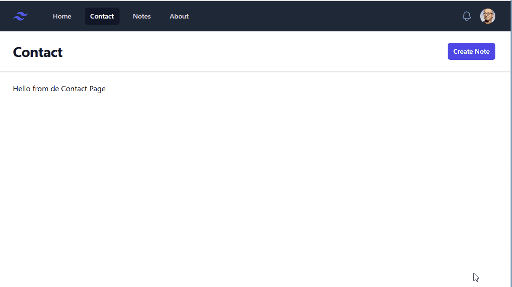

# 16. Formularios en Laravel: Siempre validar los datos

En esta 16ª lección, vamos a ver cómo validar los datos que se envían a través de un formulario en Laravel. Laravel nos proporciona una serie de clases y métodos que nos facilitan la validación de los datos.

### Recursos

- [Validación en Laravel](https://laravel.com/docs/11.x/validation#main-content)


## Algunas mejoras en el diseño

**Botón crear nota**

El botón de crear nota vamos a hacer que luzca mejor, y ubicarlo en la parte superior de la página.

¿Dónde lo ponemos? Como va a ser algo que vamos a usar en varias páginas, lo vamos a poner en el archivo `layouts/app.blade.php`.

```html
 
 <header class="bg-white shadow">
    <div class="mx-auto max-w-7xl px-4 py-6 sm:px-6 lg:px-8 flex justify-between">
        <h1 class="text-3xl font-bold tracking-tight text-gray-900"> {{ $heading }}</h1>

        <!-- Botón Create Note -->
        <a href="/notes/create"
            class="rounded-md bg-indigo-600 px-3 py-2 text-sm font-semibold text-white shadow-sm hover:bg-indigo-500 focus-visible:outline focus-visible:outline-2 focus-visible:outline-offset-2 focus-visible:outline-indigo-600">
            Create Note
        </a>
    </div>
</header>
```

Si revisamos el botón, los estilos son muy largos, y además tendremos que poder configurarlo para cuando necesitemos otro recurso (producto, categoría, etc.). Para ello, vamos a crear un componente de Blade.

Creamos un archivo llamado `components/button.blade.php` en la carpeta `resources/views/components`. Copia todo el contenido del botón.

```html
 <a href="/notes/create"
    class="rounded-md bg-indigo-600 px-3 py-2 text-sm font-semibold text-white shadow-sm hover:bg-indigo-500 focus-visible:outline focus-visible:outline-2 focus-visible:outline-offset-2 focus-visible:outline-indigo-600">
    Create Note
</a>
```

Ahora hay que hacerlo genérico, como siempre, le pasamos los `@attributes` para que pueda recibir cualquier atributo, y le ponemos las `@props` para que pueda recibir cualquier propiedad.

```php
<a {{ $attributes->merge(['class' => 
        'rounded-md bg-indigo-600 px-3 py-2 text-sm font-semibold text-white shadow-sm 
        hover:bg-indigo-500 focus-visible:outline focus-visible:outline-2 focus-visible:outline-offset-2 
        focus-visible:outline-indigo-600']) }}>
    {{ $slot }}
</a>
```

Varios puntos a explicar:

- `$attributes->merge` es un método que fusiona los atributos que le pasamos con los que ya tiene el componente. En este caso, estamos mezclando los atributos, con el atributo `class` que ya tiene el componente.
- `$slot` para que el componente pueda recibir cualquier contenido que le pasemos.


Ahora dentro del archivo `layouts/app.blade.php` vamos a incluir el componente.

```html
 <header class="bg-white shadow">
    <div class="mx-auto max-w-7xl px-4 py-6 sm:px-6 lg:px-8 flex justify-between">
        <h1 class="text-3xl font-bold tracking-tight text-gray-900"> {{ $heading }}</h1>

        <!-- Botón Create Note -->
         <x-button href="/notes/create">Create Note</x-button>
    </div>
</header>
```
Y voilà, ya tenemos nuestro botón creado y funcionando. Probar ahora y ver que todo sigue funcionando correctamente.

## Validación de datos

Para validar los datos en Laravel, se puede realizar de muchas maneras, a través de `Validation Rules`, `Form Request Validation`, `Custom Validation Rules`, etc. En este caso, vamos a ver cómo validar los datos a través de `Validation Rules`.

Las reglas de validación se definen utilizando un array asociativo, utilizando los nombres de los campos a validar, e incluyendo una serie de reglas que se deben cumplir. Las reglas más comunes son:

- `required`: El campo es obligatorio.
- `string`: El campo debe ser una cadena de texto.
- `max`: El campo debe tener un número máximo de caracteres.
- `min`: El campo debe tener un número mínimo de caracteres.
- `email`: El campo debe ser un email válido.
- `unique`: El campo debe ser único en la tabla especificada.

Además de la propia regla, también se le puede anexar información adicional, como mensajes de error.

- `string` => `'message' => 'El campo debe ser una cadena de texto'`
- `max:255` => `'message' => 'El campo debe tener un máximo de 255 caracteres'`

Estas reglas se pueden concatnear con el carácter `|`.

- `required|string|max:255`

> 💡 Todas las reglas de [validación en Laravel](https://laravel.com/docs/11.x/validation#available-validation-rules)


### Validar la creación de una nota

En nuestro WebApp, debemos valiar que los campos `title` y `body` sean obligatorios, y que `body` no pueda ser mayor de 255 caracteres.

```php
Route::post('/notes', function ()  {

    //2. Validar los datos
    //El nombre de los campos deben coincidir con los nombres de los campos del formulario
    request()->validate([
        'title' => 'required',
        'body' => 'required|max:255'
    ]);

    //3. Crear la nota
    Note::create([
        'title' => request('title'),
        'body' => request('body'),
        'user_id' => 1  //por ahora lo dejamos fijo
    ]);

    //4. Retornar la vista de la lista de notas
    return redirect('/notes');
});
```

Si hacemos este cambio, y intentamos enviar una nota sin titulo y sin body, volveremos a ver la página de creación de notas, pero no nos mostrará ningún mensaje de error. 

Si recuerdas, hemos comentado los mensajes de error en la vista `create.blade.php`. Vamos a ver cómo mostrar los mensajes de error utlizando la directiva `@error`.

**Directiva @error**

La directiva `@error` nos permite mostrar los mensajes de error asociados a un campo de un formulario. Simplemente se le pasa el nombre del campo que queremos validar, y si hay un error, se mostrará el mensaje de error, utilizando la variable `$message`.

De esta forma, quedaría así para el campo title:

```php
 <div class="sm:col-span-4">
    <label for="title" class="block text-sm/6 font-medium text-gray-900">Titulo</label>
    <div class="mt-2">
        <div
            class="flex items-center rounded-md bg-white pl-3 outline outline-1 -outline-offset-1 outline-gray-300 focus-within:outline focus-within:outline-2 focus-within:-outline-offset-2 focus-within:outline-indigo-600">
            <input type="text" name="title" id="title"
                    class="block min-w-0 grow py-1.5 pl-1 pr-3 text-base text-gray-900 placeholder:text-gray-400 focus:outline focus:outline-0 sm:text-sm/6"
                    placeholder="titulo"
                    value=""
            >
        </div>
    </div>
    @error('title')
        <p class="text-red-500 text-xs mt-2"> {{ $message }}</p>
    @enderror
</div>
```	

Si comprobamos la versión anterior con esta, veremos que es muy parecida y que Laravel hace gran parte del trabajo por nosotros. 

Versión anterior, la validación es manual, utilizando PHP puro:

```php
<?php if ($errors['category'] ?? false) : ?>
    <p class="text-red-500 text-xs mt-2"><?= $errors['category'] ?></p>
<?php endif; ?>
```

En Laravel, la directiva `@error`, hace lo mismo que el código anterior, pero de una forma más limpia y sencilla.

```php
@error('title')
    <p class="text-red-500 text-xs mt-2"> {{ $message }}</p>
@enderror
```	

**Mantener el valor del campo**

Si queremos mantener el valor del campo, en caso de que haya un error, podemos utilizar el método `old` de Laravel. Este método recibe el nombre del campo, y si hay un error, mostrará el valor que se había introducido.

Para el campo `title`, en el atributo `value`, vamos a poner el método `old('title')`, para el campo `body`, vamos a hacer lo mismo.

> 🔥 Esta técnica ya la utilizamos en la versión anterior de la aplicación, pero utilizando sesiones.


## Resultado Final

De esta forma, ahora debería mostrarnos los mensajes de error en la vista de creación de notas.



---

> ℹ️ Alguna duda? puedes ver el siguiente [video](https://laracasts.com/series/30-days-to-learn-laravel-11/episodes/17) que explica estos pasos con más detalle.