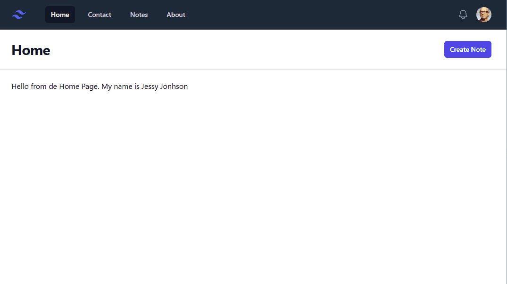

# 17. Formularios: Editar, Actualizar y Eliminar

En esta 17ª lección, vamos a ver cómo editar, actualizar y eliminar una nota. 

### Recursos

- [Validación en Laravel](https://laravel.com/docs/11.x/validation#main-content)


## Mejoras visuales y nuevas vistas para Editar y Actualizar

En este episodio también vamos a seguir aplicando mejoras visuales a nuestra aplicación.

**Lista de Notas**

Para la lista de notas, vamos a utilizar una tabla para mostrar los datos, y en la última columna, vamos a añadir un botón que nos permita editar, y también un enlace sobre el título de la nota, que nos permita ver la nota.

Para ello, como siempre utilizamos tailwindcss, y elegimos un diseño en formato tabla.

El archivo `index.blade.php` quedaría así:

```php
<x-layout heading="Notas">
  <div class="mx-auto max-w-7xl py-6 sm:px-6 lg:px-8">
    <div class="inline-block min-w-full py-2 align-middle sm:px-6 lg:px-8">
      <table class="min-w-full divide-y divide-gray-300">
        <thead>
        <tr>
          <th scope="col" class="py-3.5 pl-4 pr-3 text-left text-sm font-semibold text-gray-900 sm:pl-0">
            Titulo
          </th>
          <th scope="col" class="px-3 py-3.5 text-left text-sm font-semibold text-gray-900">Detalle</th>
          <th scope="col" class="relative py-3.5 pl-3 pr-4 sm:pr-0">
            <span class="sr-only">Editar</span>
          </th>
        </tr>
        </thead>

        <tbody class="divide-y divide-gray-200">
        @foreach($items as $item)

          <tr>
            <td class="whitespace-nowrap py-4 pl-4 pr-3 text-sm font-medium text-blue-900 sm:pl-0"><a
                href="/notes/{{$item->id}}">{{$item->title}}</a></td>
            <td class="whitespace-nowrap px-3 py-4 text-sm text-gray-500"><?= $item->title ?></td>
            <td class="relative whitespace-nowrap py-4 pl-3 pr-4 text-right text-sm font-medium sm:pr-0">
              <a href="/notes/{{ $item->id }}/edit" class="text-indigo-600 hover:text-indigo-900">Edit</a>
            </td>
          </tr>

        @endforeach
        </tbody>

      </table>
    </div>
  </div>
</x-layout>
```

**Detalle de la Nota: Visualizar**

También vamos a mejorar la visualización de la nota. Y vamos a distinguir entre la visualización de la nota y la edición de la nota.

Para ello, vamos a crear modificar el fichero `show.blade.php`, copiando el contenido del fichero `create.blade.php`. Como en este caso no vamos a necesitar el formulario, eliminamos el formulario y dejamos solo la visualización de la nota. También eliminamos el botón de guardar.

Información relevante:

- En el archivo `show.blade.php` eliminamos el formulario y dejamos solo la visualización de la nota.
- Eliminamos el botón de guardar, y renombramos `Cancelar` por `Volver`.
- En cada campo, añadimos el valor del campo, utilizando la variable `$note->title` y `$note->body`, e incluimos el aritbuto `readonly`, para que no se pueda modificar.

```php
<x-layout heading="Detalle nota">

  <div class="space-y-12">
    <div class="border-b border-gray-900/10 pb-12">
      <p class="mt-1 text-sm/6 text-gray-600">Información de la nota.</p>

      <div class="mt-10 grid grid-cols-1 gap-x-6 gap-y-8 sm:grid-cols-6">

        <div class="sm:col-span-4">
          <label for="title" class="block text-sm/6 font-medium text-gray-900">Titulo</label>
          <div class="mt-2">
            <div
              class="flex items-center rounded-md bg-white pl-3 outline outline-1 -outline-offset-1 outline-gray-300 focus-within:outline focus-within:outline-2 focus-within:-outline-offset-2 focus-within:outline-indigo-600">
              <input type="text" name="title" id="title"
                     class="block min-w-0 grow py-1.5 pl-1 pr-3 text-base text-gray-900 placeholder:text-gray-400 focus:outline focus:outline-0 sm:text-sm/6"
                     readonly
                     value="{{ $note->title }}"
              >
            </div>
          </div>
        </div>

        <!-- Detalle -->
        <div class="sm:col-span-4">
          <label for="body" class="block text-sm/6 font-medium text-gray-900">Detalle</label>
          <div class="mt-2">
            <div
              class="flex items-center rounded-md bg-white pl-3 outline outline-1 -outline-offset-1 outline-gray-300 focus-within:outline focus-within:outline-2 focus-within:-outline-offset-2 focus-within:outline-indigo-600">
              <input type="text" name="body" id="body"
                     class="block min-w-0 grow py-1.5 pl-1 pr-3 text-base text-gray-900 placeholder:text-gray-400 focus:outline focus:outline-0 sm:text-sm/6"
                     readonly
                     value="{{ $note->body }}"
              >
            </div>
          </div>
        </div>
      </div>

    </div>
  </div>

  <div class="mt-6 flex items-center justify-end gap-x-6">
    <button type="button" class="text-sm/6 font-semibold text-gray-900"><a href="/notes">Volver</a></button>
  </div>

</x-layout>
```

**Detalle de la Nota: Editar**

Para la edición de la nota, vamos a crear un nuevo archivo llamado `edit.blade.php`, y vamos a copiar el contenido del archivo `show.blade.php`, que acabmos de crear.

En este caso, vamos a añadir el formulario de edición, y vamos a cambiar el botón de `Volver` por `Cancelar`, además también agregamos un nuevo botón para guardar los cambios, y otro para eliminar la nota.

Información relevante:

- Se ha indicado en action la ruta `/notes/{{$note->id}}`.
- Se ha agregado la directiva `@method('PATCH')` para indicar que vamos a actualizar la nota.
- Se ha utilizado el método `old` para mantener el valor del campo en caso de error, o el valor actual de la nota. `value="{{ old('title') ?? $note->title }}"`.
- Se ha agregado un nuevo botón para eliminar la nota, y se ha creado un formulario oculto para eliminar la nota. En este formulario, se ha agregado la directiva `@method('DELETE')` para indicar que utilizar el método `DELETE`.
- Se ha agregado un botón para guardar los cambios.


Así, el formulario de edición quedaría así:

```php
<x-layout heading="Detalle nota">

  <form method="POST" action="/notes/{{$note->id}}">
    @csrf
    @method('PATCH')
    
    <div class="space-y-12">
      <div class="border-b border-gray-900/10 pb-12">
        <p class="mt-1 text-sm/6 text-gray-600">Información de la nota.</p>

        <div class="mt-10 grid grid-cols-1 gap-x-6 gap-y-8 sm:grid-cols-6">

          <div class="sm:col-span-4">
            <label for="title" class="block text-sm/6 font-medium text-gray-900">Titulo</label>
            <div class="mt-2">
              <div
                class="flex items-center rounded-md bg-white pl-3 outline outline-1 -outline-offset-1 outline-gray-300 focus-within:outline focus-within:outline-2 focus-within:-outline-offset-2 focus-within:outline-indigo-600">
                <input type="text" name="title" id="title"
                       class="block min-w-0 grow py-1.5 pl-1 pr-3 text-base text-gray-900 placeholder:text-gray-400 focus:outline focus:outline-0 sm:text-sm/6"
                       placeholder="titulo"
                       value="{{ old('title') ?? $note->title }}"
                >
              </div>
            </div>
            @error('title')
            <p class="text-red-500 text-xs mt-2"> {{ $message }}</p>
            @enderror
          </div>

          <!-- Detalle -->
          <div class="sm:col-span-4">
            <label for="body" class="block text-sm/6 font-medium text-gray-900">Detalle</label>
            <div class="mt-2">
              <div
                class="flex items-center rounded-md bg-white pl-3 outline outline-1 -outline-offset-1 outline-gray-300 focus-within:outline focus-within:outline-2 focus-within:-outline-offset-2 focus-within:outline-indigo-600">
                <input type="text" name="body" id="body"
                       class="block min-w-0 grow py-1.5 pl-1 pr-3 text-base text-gray-900 placeholder:text-gray-400 focus:outline focus:outline-0 sm:text-sm/6"
                       placeholder="descripción de la nota"
                       value="{{ old('body') ?? $note->body }}"
                >
              </div>
            </div>
            @error('body')
            <p class="text-red-500 text-xs mt-2"> {{ $message }}</p>
            @enderror
          </div>
        </div>

      </div>
    </div>

    <div class="mt-6 flex items-center justify-between gap-x-6">
      <div class="flex items-center">
        <button form="delete-form" class="py-2 px-4 bg-red-500 text-white rounded-md text-sm font-medium border border-transparent hover:bg-red-700">Delete</button>
      </div>

      <div class="flex items-center gap-x-6">
        <button type="button" class="text-sm/6 font-semibold text-gray-900"><a href="/notes">Volver</a></button>
          <button type="submit"
                class="rounded-md bg-indigo-600 px-3 py-2 text-sm font-semibold text-white shadow-sm hover:bg-indigo-500 focus-visible:outline focus-visible:outline-2 focus-visible:outline-offset-2 focus-visible:outline-indigo-600">
          Update
        </button>
      </div>
    </div>

  </form>

  <form method="POST" action="/notes/{{ $note->id }}" id="delete-form" class="hidden">
    @csrf
    @method('DELETE')
  </form>

</x-layout>
```

## Lógica y rutas para Editar, Actualizar y Eliminar

Ahora que tenemos listo los cambios visuales y las nuevas vistas, necesitamos agregar las rutas que ejecuten el código necesario para editar, actualizar y eliminar una nota.

**Editar**

Para editar una nota, hemos indicado que utilizaremos el método `PATCH`, por tanto necesitamos crear una nueva ruta en el archivo `web.php`.

```php
//update
Route::patch('/notes/{id}', function ($id)  {

  //2. Validar los datos
  //3. Autorizar (próximamente)
  //4. Actualizar la nota en BD
  //5. Redireccionar a la lista de notas

});
```

Para la validación utilizamos el mismo código que en la creación de una nota, y para actualizar la nota, utilizamos el método `update` de Eloquent. Además si la nota no existe, debemos lanzar un error 404. Ponemos todo esto en el código de la ruta.

```php
Route::patch('/notes/{id}', function ($id)  {

  //2. Validar los datos
  request()->validate([
    'title' => ['required', 'min:5'],
    'body' => ['required', 'max:255']
  ]);

  //3. Autorizar (próximamente)

  //4. Obtener y actualizar la nota
  $note = Note::findOrFail($id);

  $note->update([
    'title' => request('title'),
    'body' => request('body'),
  ]);

  //5. Retornar la vista de la lista de notas
  return redirect('/notes');

});
```

Y si probamos ahora, veremos que podemos editar una nota, y que los cambios se guardan correctamente. En caso de error, también se muestra el mensaje de error y se mantiene el valor del campo introducido.

**Eliminar**

Por último para eliminar una nota, necesitamos crear una nueva ruta en el archivo `web.php`.

```php
//destroy
Route::patch('/notes/{id}', function ($id)  {

  //2. Obtener nota nota, y si no existe, lanzar un error 404
  //3. Autorizar (próximamente)
  //4. Eliminar la nota
  //5. Redireccionar a la lista de notas

});
```

Así después de aplicar todo esto, la ruta para eliminar una nota quedaría así:

```php
Route::delete('/notes/{id}', function ($id)  {

  //2. Obtener nota nota, y si no existe, lanzar un error 404
  $note = Note::findOrFail($id);

  //3. Autorizar (próximamente)

  //4. Eliminar la nota
  $note->delete();

  //5. Redireccionar a la lista de notas
  return redirect('/notes');
});
```

Si probamos ahora, veremos que podemos eliminar una nota, y que la nota desaparece de la lista de notas.


## Resultado Final

De esta forma, después de aplicar todos estos cambios, hemos mejorado la visualización de la lista de notas, y hemos añadido las vistas de edición y visualización de una nota. Con lo que el resultado final sería algo así:



---

> ℹ️ Alguna duda? puedes ver el siguiente [video](https://laracasts.com/series/30-days-to-learn-laravel-11/episodes/18) que explica estos pasos con más detalle.