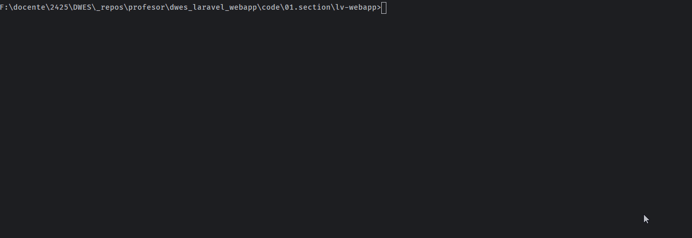

# 18. Mejorar rutas

En esta 18ª lección, vamos a ver cómo podemos mejorar nuestras rutas, utilizando distintas opciones que nos da Laravel, como controladores, rutas con nombres, etc ..

### Recursos

- [6 Tips to Organize Routes](https://laravel-news.com/laravel-route-organization-tips)


## Técnicas para mejorar las rutas

Existen diferentes opciones en laravel para mejorar nuestras rutas, dependiendo de la complejidad de nuestra aplicación, podemos utilizar una u otra.

Las veremos de más sencillas a más complejas.

### 1. Route Model Binding

Laravel nos permite obtener un modelo directamente desde la ruta, sin tener que hacer la consulta manualmente. Esto se llama `Route Model Binding`.

> 🪧 Para más info consulta la [documentación de Laravel](https://laravel.com/docs/11.x/folio#route-model-binding) sobre este tema.

Para aplicar esta ténnica, el parámetro `wilcard` de la ruta debe coincidir con el nombre de un modelo, y Laravel sabrá cúal es el campo ID de ese módelo y por tanto, cómo debe hacer la consulta.

En nuestro fichero de rutas `web.php`, vamos a aplicar esta técnica para visualizar una ruta:

```php
//show
Route::get('/notes/{note}', function (Note $note) {
    //{note} es el parámetro wildcard que coincide con el nombre del modelo. La función recibe el modelo directamente.
    return view('notes.show', ['note' => $note]);
});
```

También puede ocurrir, que queramos buscar por otro campo distinto al ID. En este caso, debemos sobreescribir el método `getRouteKeyName` en el modelo. Imaginemos que nuestra nota tiene un campo único, texto, llamado `slug`. Un slug es una cadena de texto que identifica de forma única una nota, ejemplo: `mi-nota`.

```php
class Note extends Model
{
    public function getRouteKeyName()
    {
        return 'slug';
    }
}
```

Otra opción más directa, es indicar el nombre del campo en la ruta:

```php
Route::get('/notes/{note:slug}', function (Note $note) {
    //Laravel buscará la nota por el campo slug en lugar de por el campo id
    return view('notes.show', ['note' => $note]);
});
```

De esta forma, Laravel buscará la nota por el campo `slug` en lugar de por el campo `id`.

También vamos a aplicar esto, a la ruta de edición, y a la de Update y Delete.

```php
//edit
Route::get('/notes/{note}/edit', function (Note $note) {
    return view('notes.edit', ['note' => $note]);
});
```

```php
//update
Route::put('/notes/{note}', function (Note $note) {
    //Validar los datos
    request()->validate([
        'title' => 'required',
        'body' => 'required|max:255'
    ]);

    //Actualizar la nota
    $note->update([
        'title' => request('title'),
        'body' => request('body')
    ]);

    return redirect('/notes');
});

//delete
Route::delete('/notes/{note}', function (Note $note) {
    $note->delete();
    return redirect('/notes');
});
```

> 💡 En caso de que no encuentre la nota, mostrará un error 404 NotFound.

Aplica estos cambios y comprueba que todo sigue funcionando correctamente.


### 2. Controladores como Clases

Si nuestra aplicación es más compleja, y tenemos muchas rutas, y las rutas requieren de lógica más compleja, es recomendable encapsular esa lógica en un controlador.

Los controladores son clases, que contendrán un método para cada acción que queramos realizar. 

Van a existir 2 tipos de controlares principalemente:

- Controladores de recursos (Que contienen la lógica para las 7 acciones CRUD)
- Controladores invocables (que contienen un único método `__invoke`, para una sola acción)

Para crear un controlador, lo podemos hacer manualmente, o utilizando artisan:

```bash
php artisan make:controller NoteController
```

o, la forma recomendada, es como se muestra en el siguiente video.



Como se muestra en el video, vamos a crear un controlador de recursos, que contendrá la lógica para todas las acciones CRUD. El nuevo controlador estará ubicado en la carpeta `app/Http/Controllers`.

Si lo revisamos, comprobaremos que es una clase que contiene los siguientes métodos:

- public function index()
- public function create()
- public function store(Request $request)
- public function show(Note $note)
- public function edit(Note $note)
- public function update(Request $request, Note $note)
- public function destroy(Note $note)

> 💡 Al asociar un modelo en la creación del controlador, Laravel automaticamente indica el tipo del modelo en los diferentes métodos. 👌🏼

Ahora vamos a convertir nuestras rutas en rutas de recursos, que apuntarán a los métodos del controlador. Para ello, podemos utilizar 2 diferentes sintaxis, si tenemos un controlador con todas las acciones CRUD, o existen algunas acciones no disponibles.

1. Opción 1: Todas las acciones CRUD

  Laraval se encargará de instanciar el controlador, y de llamar al método correspondiente. Recuerda Laravel funciona por convención sobre configuración.

  ```php
  Route::resource('notes', NoteController::class);
  ```
2. Opción 2: Algunas acciones no disponibles

  En este caso, debemos indicar las acciones que no queremos que se realicen, y Laravel no creará las rutas para esas acciones.

  ```php
  Route::resource('notes', NoteController::class)->except(['destroy']);
  ```
  
  o si existen solo algunas acciones que queremos que se realicen:

  ```php
  Route::resource('notes', NoteController::class)->only(['index', 'show']);
  ```
3. Opción 3: Controladores invocables

  Utilizar una ruta por acción, e indicar el controlador y el método a ejecutar.

  ```php
  Route::get('/notes', [NoteController::class, 'index']);
  ```


En nuestro caso, ya que tenemos todas las acciones CRUD, vamos a utilizar la opción 1.


**Convertir las rutas en rutas de recursos**

Con esta opción, ahora en el fichero de rutas `web.php`, todo se hace mucho más simple.

Comenta las rutas que teníamos antes, y añade la siguiente línea:

```php
//NOTAS
Route::resource('notes', NoteController::class);

// ** NOTAS forma anterior **
//index
//Route::get('/notes', function () {
//    return view('notes.index', ['items' => Note::all()]);
//});

//create
//Route::get('/notes/create', function ()  {
//    return view('notes.create', []);
//});

//edit
//Route::get('/notes/{note}/edit', function (Note $note) {
//    return view('notes.edit', ['note' => $note]);
//});

//show
//Route::get('/notes/{note}', function (Note $note) {
//    return view('notes.show', ['note' => $note]);
//});

//store
//Route::post('/notes', function ()  {
//
//    //2. Validar los datos
//    request()->validate([
//        'title' => ['required'],
//        'body' => ['required', 'max:255']
//    ]);
//
//    //3. Crear la nota
//    Note::create([
//        'title' => request('title'),
//        'body' => request('body'),
//        'user_id' => 1  //por ahora lo dejamos fijo
//    ]);
//
//    //4. Retornar la vista de la lista de notas
//    return redirect('/notes');
//});

//update
//Route::patch('/notes/{note}', function (Note $note)  {
//
//  //2. Validar los datos
//  request()->validate([
//    'title' => ['required', 'min:5'],
//    'body' => ['required', 'max:255']
//  ]);
//
//  //3. Autorizar (próximamente)
//
//  //4. Obtener y actualizar la nota
//
//  $note->update([
//    'title' => request('title'),
//    'body' => request('body'),
//  ]);
//
//  //5. Retornar la vista de la lista de notas
//  return redirect('/notes');
//
//});

//destroy
//Route::delete('/notes/{note}', function (Note $note)  {
//
//  //2. Obtener nota nota, y si no existe, lanzar un error 404
//
//
//  //3. Autorizar (próximamente)
//
//  //4. Eliminar la nota
//  $note->delete();
//
//  //5. Redireccionar a la lista de notas
//  return redirect('/notes');
//});
```

Y el controller `NoteController` quedaría así:

```php
<?php

namespace App\Http\Controllers;

use App\Models\Note;
use Illuminate\Http\Request;

class NoteController extends Controller {
  /**
   * Display a listing of the resource.
   */
  public function index() {
    return view('notes.index', ['items' => Note::all()]);
  }

  /**
   * Store a newly created resource in storage.
   */
  public function store(Request $request) {
    //2. Validar los datos
    request()->validate([
      'title' => ['required'],
      'body' => ['required', 'max:255']
    ]);

    //3. Crear la nota
    Note::create([
      'title' => request('title'),
      'body' => request('body'),
      'user_id' => 1  //por ahora lo dejamos fijo
    ]);

    //4. Retornar la vista de la lista de notas
    return redirect('/notes');
  }

  /**
   * Show the form for creating a new resource.
   */
  public function create() {
    return view('notes.create', []);
  }

  /**
   * Display the specified resource.
   */
  public function show(Note $note) {
    return view('notes.show', ['note' => $note]);
  }

  /**
   * Show the form for editing the specified resource.
   */
  public function edit(Note $note) {
    return view('notes.edit', ['note' => $note]);
  }

  /**
   * Update the specified resource in storage.
   */
  public function update(Request $request, Note $note) {
    //2. Validar los datos
    request()->validate([
      'title' => ['required', 'min:5'],
      'body' => ['required', 'max:255']
    ]);

    //3. Autorizar (próximamente)

    //4. Obtener y actualizar la nota

    $note->update([
      'title' => request('title'),
      'body' => request('body'),
    ]);

    //5. Retornar la vista de la lista de notas
    return redirect('/notes');
  }

  /**
   * Remove the specified resource from storage.
   */
  public function destroy(Note $note) {
    //3. Autorizar (próximamente)

    //4. Eliminar la nota
    $note->delete();

    //5. Redireccionar a la lista de notas
    return redirect('/notes');

  }
}
```

Haz estos cambios, y comprueba que todo sigue funcionando correctamente.

*La pregunta interesante que te estarás preguntando, ¿porqué sigue todo funcionando si las rutas han cambiado? La respuesta es que Laravel sigue funcionando por convención sobre configuración, y cómo nuestro código seguía las convecciones de Laravel, todo sigue funcionando correctamente.*

Si por algún motivo no hubieramos seguido las convecciones, aún podríamos utilizar un controlador de recursos, pero tendríamos que indicar las rutas manualmente.

De esa forma, quedaría así:

```php
//NOTAS
Route::get('/notes', [NoteController::class, 'index']);
Route::get('/notes/create', [NoteController::class, 'create']);
Route::post('/notes', [NoteController::class, 'store']);
Route::get('/notes/{note}', [NoteController::class, 'show']);
Route::get('/notes/{note}/edit', [NoteController::class, 'edit']);
Route::patch('/notes/{note}', [NoteController::class, 'update']);
Route::delete('/notes/{note}', [NoteController::class, 'destroy']);
```

En ambos casos, al utilizar un controlador, el fichero de rutas `web.php` queda mucho más limpio y fácil de leer.


**Listar las rutas**

Cuando una aplicación crece, es posible que tengamos muchas rutas, y no sepamos exactamente cuáles son. Para listar todas las rutas de nuestra aplicación, podemos utilizar el comando artisan `route:list`.

```bash
php artisan route:list
```

En nuestro caso el resultado sería el siguiente:

```bash
+--------+-----------+------------------------+-----------------+-------------------------------------------------+------------+
| Domain | Method    | URI                    | Name            | Action                                          | Middleware |
+--------+-----------+------------------------+-----------------+-------------------------------------------------+------------+
|        | GET|HEAD  | /                      |                 | Closure                                          | web        |
|        | GET|HEAD  | /about                 |                 | Closure                                          | web        |
|        | GET|HEAD  | /contact               |                 | Closure                                          | web        |
|        | GET|HEAD  | notes                  | notes.index     | App\Http\Controllers\NoteController@index        | web        |
|        | POST      | notes                  | notes.store     | App\Http\Controllers\NoteController@store        | web        |
|        | GET|HEAD  | notes/create           | notes.create    | App\Http\Controllers\NoteController@create       | web        |
|        | GET|HEAD  | notes/{note}           | notes.show      | App\Http\Controllers\NoteController@show         | web        |
|        | PUT|PATCH | notes/{note}           | notes.update    | App\Http\Controllers\NoteController@update       | web        |
|        | DELETE    | notes/{note}           | notes.destroy   | App\Http\Controllers\NoteController@destroy      | web        |
|        | GET|HEAD  | notes/{note}/edit      | notes.edit      | App\Http\Controllers\NoteController@edit         | web        |
+--------+-----------+------------------------+-----------------+-------------------------------------------------+------------+
```

Si no queremos ver rutas de terceros, podemos utilizar la opción `--except-vendor`.:

```bash
php artisan route:list -except-vendor
```

### 3. Rutas con nombre

Las rutas con nombre, nos permiten nombrar una ruta, y utilizar ese nombre en lugar de la URL en nuestros enlaces, redirecciones, etc. Esto es muy útil, ya que nos permiten nombrar a la ruta con un nombre más descriptivo, y si en algún momento cambiamos la URL, no tendremos que cambiar en todos los lugares donde se utiliza.

Para nombrar una ruta, simplemente añadimos el método `name` a la definición de la ruta.

```php
Route::get('/about', function () {
    return view('about');
})->name('about');

Route::get('/contact', function () {
    return view('contact');
})->name('contact');

Route::get('/notes', [NoteController::class, 'index'])->name('notes.index');
Route::get('/notes/create', [NoteController::class, 'create'])->name('notes.create');
Route::post('/notes', [NoteController::class, 'store'])->name('notes.store');
Route::get('/notes/{note}', [NoteController::class, 'show'])->name('notes.show');
Route::get('/notes/{note}/edit', [NoteController::class, 'edit'])->name('notes.edit');
Route::put('/notes/{note}', [NoteController::class, 'update'])->name('notes.update');
Route::delete('/notes/{note}', [NoteController::class, 'destroy'])->name('notes.destroy');

//Para un ruta tipo resource
Route::resource('notes', NoteController::class)->names([
    'index' => 'notes.index',
    'create' => 'notes.create',
    'store' => 'notes.store',
    'show' => 'notes.show',
    'edit' => 'notes.edit',
    'update' => 'notes.update',
    'destroy' => 'notes.destroy'
]);
```

Ahora podemos utilizar esta nomenclatura en nuestros enlaces, redirecciones, etc.

```php
<a href="{{ route('about') }}">About</a>
<a href="{{ route('contact') }}">Contact</a>
```

y también en las redirecciones:

```php
return redirect()->route('notes.index');
```

y para saber si una ruta es la actual, podemos utilizar el método `is`:

```php
request()->routeIs('notes.index');
```

Como podemos comprobar, las rutas con nombre, nos permiten tener un código más limpio y fácil de leer.

### 4. Agrupar las rutas

Si tenemos rutas que comparten un prefijo, por ejemplo, en nuestras rutas de notas, todas empiezan por `/notes`, podemos agruparlas, y de esa forma, no tener que repetir ese prefijo en todas las rutas.

Para agrupar las rutas, utilizamos el método `Route::controller`, y dentro de ese método, definimos las rutas que queremos agrupar.

```php
Route::controller('notes')->group(function () {
    //El controlador ya no es necesario indicarlo.
    Route::get('/notes','index')->name('notes.index');
    Route::get('/notes/create','create')->name('notes.create');
    Route::post('/notes','store')->name('notes.store');
    Route::get('/notes/{note}','show')->name('notes.show');
    Route::get('/notes/{note}/edit','edit')->name('notes.edit');
    Route::put('/notes/{note}','update')->name('notes.update');
    Route::delete('/notes/{note}','destroy')->name('notes.destroy');
});
```

También podemos utilizar el método `prefix` para indicar un prefijo común a todas las rutas, y de esa forma, no tener que repetirlo en todas las rutas:

```php
Route::prefix('notes')->group(function () {
  Route::get('/', [NoteController::class, 'index'])->name('notes.index');
  Route::get('/create', [NoteController::class, 'create'])->name('notes.create');
  Route::post('/', [NoteController::class, 'store'])->name('notes.store');
  Route::get('/{note}', [NoteController::class, 'show'])->name('notes.show');
  Route::get('/{note}/edit', [NoteController::class, 'edit'])->name('notes.edit');
  Route::put('/{note}', [NoteController::class, 'update'])->name('notes.update');
  Route::delete('/{note}', [NoteController::class, 'destroy'])->name('notes.destroy');
});
```

Existen otras formas más avanzadas de agrupación de rutas, para más información consulta el siguiente artículo: [6 Tips to Organize Routes](https://laravel-news.com/laravel-route-organization-tips)


Con estas técnicas, hemos mejorado nuestras rutas, y hemos hecho nuestro código más limpio y fácil de leer.

🏁 ¡Enhorabuena! ¡Has completado la lección! ¡Vamos a la siguiente!

---

> ℹ️ Alguna duda? puedes ver el siguiente [video](https://laracasts.com/series/30-days-to-learn-laravel-11/episodes/19) que explica estos pasos con más detalle.