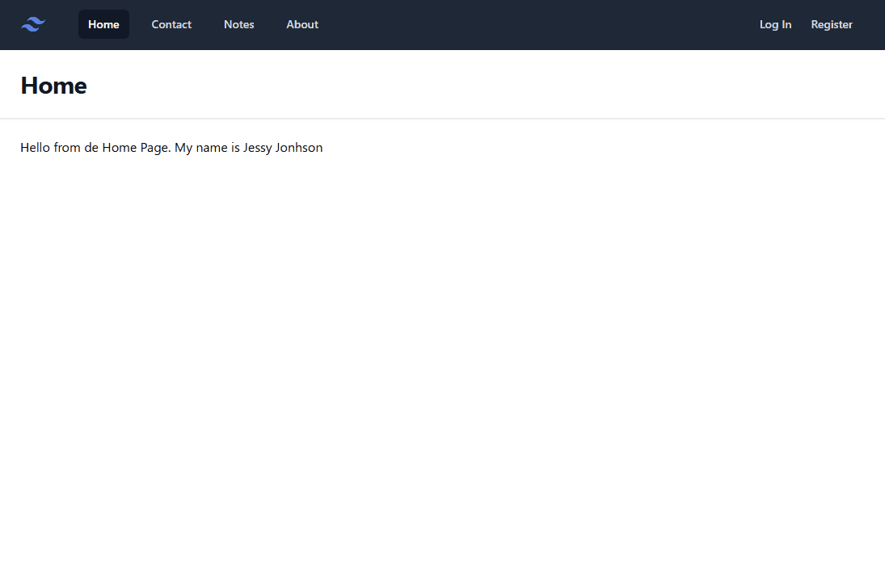
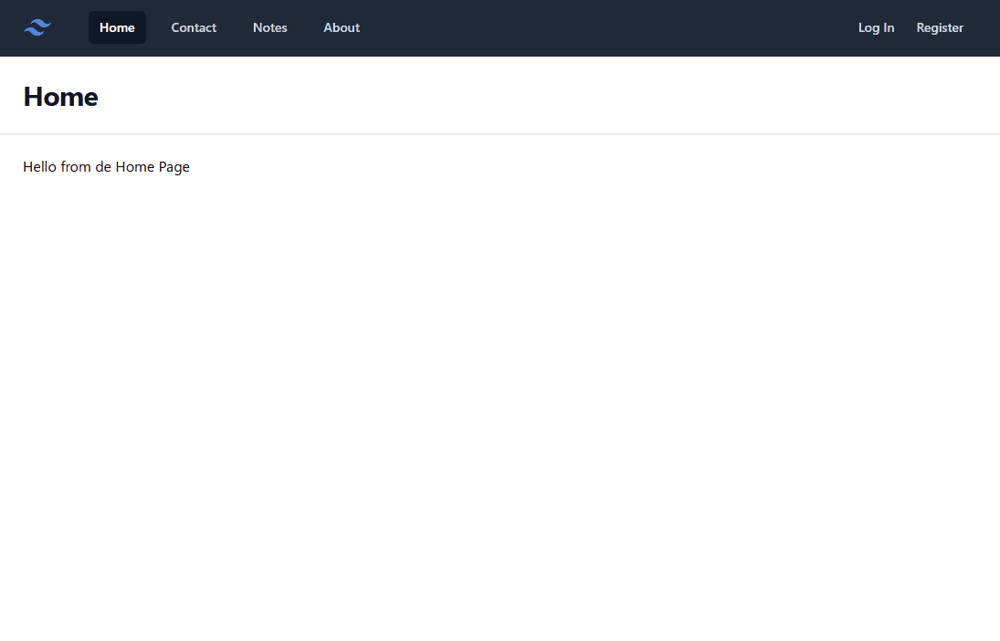

# 19. Crear un sistema de login y registro

En esta 19ª lección, vamos a ver cómo crear un sistema de login y registro en Laravel. Laravel nos proporciona una forma muy sencilla de hacerlo, a través de starter kits, que nos permiten tener un sistema de login y registro en pocos minutos, pero nosotros lo vamos a haer manualmente, para entender cómo funciona por dentro.

### Recursos

- [6 Tips to Organize Routes](https://laravel-news.com/laravel-route-organization-tips)

## Crear componentes para los controles de formulario

Hemos realizado ya algunos formularios, y vemos que se repiten constantemente los mismos controles, además como utilizamos Tailwind, los estilos también se repiten. Vamos a crear componentes para los controles de formulario.

Tendremos los siguientes controles:

- form-button: botón de formulario
- form-input: input de formulario
- form-label: label de formulario
- form-input: agrupa un label y un input
- form-error: muestra los errores de validación

Lo primero, para mejorar la organización de los mismos, vamos a crear dentro de la carpeta `components` un subdirectorio llamado `forms`. Dentro de este subdirectorio, vamos a crear los siguientes archivos:

- button.blade.php
- input.blade.php
- label.blade.php
- group.blade.php
- error.blade.php

Para ello, vamos a utilizar cualquier de los formularios, para copiar el contenido de los controles. Todos estos controles los vamos a crear en la carpeta `resources/views/components/forms`.

### button.blade.php

```php
@props(['className' => ''])

<?php
  $attributes = $attributes->merge(['class' => $className,'type' => 'submit'])
  ->class([
    'rounded-md bg-indigo-600 px-3 py-2 text-sm font-semibold text-white shadow-sm hover:bg-indigo-500 focus-visible:outline focus-visible:outline-2 focus-visible:outline-offset-2 focus-visible:outline-indigo-600'
  ])
?>

<button {{ $attributes }}>
  {{ $slot }}
</button>
```

Este botón permite recibir una serie de clases para poder personalizarlo.

### error.blade.php

```php
<label {{ $attributes->merge(['class' => 'block text-sm font-medium leading-6 text-gray-900']) }}>
  {{ $slot }}
</label>
```	

### field-group.blade.php

```php
<div class="sm:col-span-4">
  {{ $slot }}
</div>
```

### input.blade.php

```php
<div class="flex rounded-md shadow-sm ring-1 ring-inset ring-gray-300 focus-within:ring-2 focus-within:ring-inset focus-within:ring-indigo-600 sm:max-w-md">
  <input {{ $attributes->merge(['class' => 'block flex-1 border-0 bg-transparent py-1.5 px-3 text-gray-900 placeholder:text-gray-400 focus:ring-0 sm:text-sm sm:leading-6']) }}>
</div>
```	

### label.blade.php

```php
<label {{ $attributes->merge(['class' => 'block text-sm font-medium leading-6 text-gray-900']) }}>
  {{ $slot }}
</label>
```

## Agregar menús para Login y Register

Antes de nada, necesitamos crear los menús necesarios para que el usuario pueda registrarse y si ya está registrado, pueda hacer login.

Al fichero `layout.blade.php` añadimos los siguientes enlaces:

```html
<div class="flex h-16 items-center justify-between">
  <div class="flex items-center">
    <div class="shrink-0">
      
    </div>
    <div class="hidden md:block">
      <div class="ml-10 flex items-baseline space-x-4">
        <x-nav-link href="/" :active="request()->is('/')">Home</x-nav-link>
        <x-nav-link href="/contact" :active="request()->is('contact')">Contact</x-nav-link>
        <x-nav-link href="/notes" :active="request()->is('notes')">Notes</x-nav-link>
        <x-nav-link href="/about" :active="request()->is('about')">About</x-nav-link>
      </div>
    </div>
  </div>
  <!-- Enlaces para login/register -->
  <div class="hidden md:block">
    <div class="ml-4 flex items-center md:ml-6">
        <x-nav-link href="/login" :active="request()->is('login')">Log In</x-nav-link>
        <x-nav-link href="/register" :active="request()->is('register')">Register</x-nav-link>
    </div>
  </div>
</div>
```

## Agregar vista para Login y Register

En nuestra anterior aplicación creamos una vista para Login y Register. Vamos a utilizar estas vistas y las vamos a convertir a Blade.

Estas vistas las vamos a crear dentro de una nueva carpeta, llamada `auth`, dentro de la carpeta `resources/views`.

Dentro de la carpeta `auth`, creamos dos archivos: `login.blade.php` y `register.blade.php`.

Para la vista `register.blade.php` vamos a utilizar el `layout.blade.php` que hemos creado anteriormente, y vamos a colocar dentro del `slot` el contenido de la vista.

```php
<x-layout>
  <div class="flex min-h-full items-center justify-center py-12 px-4 sm:px-6 lg:px-8">
    <div class="w-full max-w-md space-y-8">
      <div>
        <h2 class="mt-6 text-center text-3xl font-bold tracking-tight text-gray-900">Register</h2>
      </div>
      <form method="POST" action="/register">
        @csrf

        <div class="space-y-12">
          <div class="border-b border-gray-900/10 pb-12">
            <div class="flex flex-col gap-3">
              <x-forms.field-group>
                <x-forms.label for="name">Name</x-forms.label>

                <div class="mt-2">
                  <x-forms.input name="name" id="name" required/>

                  <x-forms.error name="name"/>
                </div>
              </x-forms.field-group>

              <x-forms.field-group>
                <x-forms.label for="email">Email</x-forms.label>

                <div class="mt-2">
                  <x-forms.input name="email" id="email" type="email" required/>

                  <x-forms.error name="email"/>
                </div>
              </x-forms.field-group>

              <x-forms.field-group>
                <x-forms.label for="password">Password</x-forms.label>

                <div class="mt-2">
                  <x-forms.input name="password" id="password" type="password" required/>

                  <x-forms.error name="password"/>
                </div>
              </x-forms.field-group>

              <x-forms.field-group>
                <x-forms.label for="password_confirmation">Confirm Password</x-forms.label>

                <div class="mt-2">
                  <x-forms.input name="password_confirmation" id="password_confirmation" type="password" required/>

                  <x-forms.error name="password_confirmation"/>
                </div>
              </x-forms.field-group>
            </div>
          </div>
        </div>

        <div class="mt-6 flex items-center justify-end gap-x-6">
          <a href="/" class="text-sm font-semibold leading-6 text-gray-900">Cancel</a>
          <x-forms.button>Register</x-forms.button>
        </div>
      </form>
    </div>
  </div>
</x-layout>

```	
Para el usuario, se han creado los campos `name`, `email`, `password` y `password_confirmation`.<br>
Y se ha indicado con la ruta `action="/register"`.


y para la vista `login.blade.php`:

```php
<x-layout :header_btn="false">

  <div class="flex min-h-full items-center justify-center py-12 px-4 sm:px-6 lg:px-8">
    <div class="w-full max-w-md space-y-8">
      <div>
        
        <h2 class="mt-6 text-center text-3xl font-bold tracking-tight text-gray-900">Log In</h2>
      </div>

      <form class="flex-[0.5]" method="POST" action="/login">
        @csrf

        <div class="space-y-12">
          <div class="border-b border-gray-900/10 pb-12">
            <div class="flex flex-col gap-3">
              <x-forms.field-group>
                <x-forms.label for="email">Email</x-forms.label>

                <div class="mt-2">
                  <x-forms.input name="email" id="email" type="email" :value="old('email')" required/>

                  <x-forms.error name="email"/>
                </div>
              </x-forms.field-group>

              <x-forms.field-group>
                <x-forms.label for="password">Password</x-forms.label>

                <div class="mt-2">
                  <x-forms.input name="password" id="password" type="password" required/>

                  <x-forms.error name="password"/>
                </div>
              </x-forms.field-group>
            </div>
          </div>
        </div>

        <div class="mt-6 flex items-center justify-end gap-x-6">
          <a href="/" class="text-sm font-semibold leading-6 text-gray-900">Cancel</a>
          <x-forms.button>Log In</x-forms.button>
        </div>
      </form>
    </div>
  </div>
</x-layout>
```	

Para el inicio-sesión, se utilizan los campos `email` y `password`.
Y se ha indicado con la ruta `action="/login"`.

### Mejora en Layout

En el layout la propiedad `heading` se le ha asignado un valor por defecto, y además se ha agregado otra propiedad `header_btn` para poder mostrar o no el botón en la cabecera.
Por tanto, las props del layout son: `@props(['heading' => '', 'header_btn' => false])`. La propiedad `header_btn` se utiliza para mostrar o no el botón en la cabecera. Aplica este cambio en el layout.

## Crear el controlador para Login y Register

Ahora tendremos que crear un controlador para el Login y otro para el registro de un usuario.

Para este caso, vamos a crear manualmente el controlador, dentro de la carpeta `app/Http/Controllers`, y lo llamaremos `RegisterUserController.php`. Y le vamos a agregar 2 métodos: `create` y `store`.

```php
class RegisterUserController extends Controller
{
    public function create()
    {
        //Visualizar la vista del formulario de registro 
        return view('auth.register');
    }

    public function store()
    {
        //Validación

        //Creación del usuario

        //Iniciar sesión

        //Redirección a página de inicio
    }
}
```	

Y para el controlador de Login, vamos a crear otro controlador, llamado `SessionController.php`, y le vamos a agregar 3 métodos: `create`, `store` y `destroy`. Este controlador va a ser el encargado de iniciar y cerrar la sesión del usuario.

```php
class SessionController extends Controller
{
    public function create()
    {
        //Visualizar la vista del formulario de login
        return view('auth.login');
    }

    //Iniciar sesión
    public function store()
    {
       //Validar los datos email y password

       //Verificar que existe un usuario con esos datos

       //iniciar sesión

       //Redirección a la página de inicio
    }

    public function destroy()
    {
        //Cerrar sesión

        //Redirección a la página de inicio
    }
}
```

## Crear las rutas para Login y Register

Ahora que ya tenemos los controladores, vamos a crear las rutas para acceder al formulario de registro y de login.

En el fichero de rutas `web.php`, vamos a agregar las siguientes rutas:

```php

//RUTAS AUTH
Route::get('/register', [RegisterUserController::class, 'create']);  //Formulario de registro
Route::post('/register', [RegisterUserController::class, 'store']);  //Registrar usuario

Route::get('/login', [SessionController::class, 'create']);  //Formulario de login
Route::post('/login', [SessionController::class, 'store']);  //Iniciar sesión
Route::post('/logout', [SessionController::class, 'destroy']);  //Cerrar sesión
```

Ahora, después de todo esto, vamos a comprobar que funciona. El resultado debería ser algo así.



  
## Aplicar lógica a los controladores Register y Session

### Registar un nuevo Usuario

Como has comprobado, en el controlador `RegisterUserController` hemos creado un método `store` que se encargará de registrar un nuevo usuario, y se ha indicado una serie de pasos a seguir. Vamos a ver cómo hacerlo.

```php
//app/Http/Controllers/RegisterUserController.php
 public function store()
  {
    //Validación

    //Creación del usuario

    //Iniciar sesión

    //Redirección a página de inicio
  }
```
#### Pasos:

**Validación**:

Laravel nos proporciona una forma muy sencilla de validar los datos, a través de `Validation Rules`, como vimos en alguna lección anterior.

En base a los campos que hemos creado en el formulario de registro, vamos a validar que los campos `name`, `email`, `password` y `password_confirmation` sean obligatorios, y que `email` sea un email válido, y que `password` y `password_confirmation` sean iguales.

De todos estos campos, el más complejo es el `password` ya que podemos imponer una serie de reglas, como que tenga un mínimo de caracteres, que tenga al menos un número, una mayúscula, una minúscula, etc. Laravel nos proporciona una regla llamada `password` que nos permite validar la contraseña de una forma muy sencilla.

Por ejemplo, si queremos que la contraseña tenga un mínimo de 8 caracteres, y que tenga al menos una mayúscula, una minúscula y un número y un simbolo, podemos hacerlo de la siguiente manera: `Password::min(8)->mixedCase()->numbers()->symbols`. También debemos comprobar que `password` y `password_confirmation` sean iguales, para ello, utilizar la regla `confirmed`. Con la regla `confirmed`, Laravel buscará un campo llamado `password_confirmation` y comprobará que sea igual al campo `password`. Si el campo no se llama `password_confirmation`, se le puede pasar después de dos puntos `:` el nombre del campo.

*En el formulario de registro, hemos creado un campo `password_confirmation`, revisa que este campo se llame así, si no es así, cámbialo.*

```php
request()->validate([
    'name' => 'required',
    'email' => 'required|email',
    'password' => ['required',Password::min(8)->mixedCase()->numbers()->symbols(), 'confirmed:password_confirmation'],
  ]);
```
En nuestro caso, y para facilitar las pruebas, solo pondremos que tenga al menos 6 caracteres.

**Crear el usuario**:

Para crear un usuario, utilizamos el modelo `User`, y llamamos al método `create`, pasándole un array asociativo con los campos que queremos guardar en la base de datos. Estos datos son los mismos que hemos validado anteriormente. El método `validate` nos devuelve un array con los datos validados, por lo que podemos utilizar este array para crear el usuario.

```php	
$validatedAttributes = request()->validate([
    'name' => 'required',
    'email' => 'required|email',
    'password' => ['required',Password::min(8)->mixedCase()->numbers()->symbols(), 'confirmed:password_confirmation'],
  ]);

  //Y para crear el usuario, utilizamos el modelo User
$user = User::create($validatedAttributes);	
```

**Iniciar sesión**:

Si todo es correcto, el usuario se habrá creado correctamente (en caso contrario, Laravel nos devolverá un error), y ahora debemos iniciar sesión. Para iniciar sesión, vamos a utilizar el método `login` que nos proporciona Laravel. Este método recibe un usuario como parámetro, y este usuario será el que se logueará en la aplicación.

```php
//Iniciar sesión
Auth::login($user);
```

Por último, redirigimos al usuario a la página de inicio.

```php
//Redirección a página de inicio
return redirect('/');
```

Y con todo esto, ya tendríamos el método `store` completo.

```php
//app/Http/Controllers/RegisterUserController.php
public function store()
{
    //Validación
    $validatedAttributes = request()->validate([
      'name' => 'required',
      'email' => 'required|email',
      'password' => ['required',Password::min(6), 'confirmed:password_confirmation'],
    ]);

    //Creación del usuario
    $user = User::create($validatedAttributes);

    //Iniciar sesión
    Auth::login($user);

    //Redirección a página de inicio
    return redirect('/');
}
```

### Iniciar sesión

Para iniciar sesión, vamos a utilizar el controlador `SessionController`, y el método `store`, siguiendo la convención de Laravel, aunque no creamos nada, de alguna forma estamos (creando) almacenando la sesión del usuario. Al igual que para registrar un usuario, vamos a seguir una serie de pasos.

```php
//app/Http/Controllers/SessionController.php
 public function store()
  {
    //Validar los datos email y password

    //Verificar que existe un usuario con esos datos

    //Regegistrar sesión

    //Redirección a la página de inicio
  }
```

#### Pasos:

**Validar los datos**:

La validación de los datos es muy similar a la que hemos hecho para el registro de un usuario, solo que en este caso, solo necesitamos validar los campos `email` y `password`.

```php
request()->validate([
    'email' => 'required|email',
    'password' => 'required',
  ]);
```

**Verificar que existe un usuario con esos datos**:

Para verificar que existe un usuario con esos datos, vamos a utilizar el método `attempt` que nos proporciona Laravel. Este método recibe un array asociativo con los campos `email` y `password`, y si existe un usuario con esos datos, directamente iniciará sesión. Pero en caso de que el usuario no exista, vamos a lanzar una excepción, concretamente una excepción de tipo `ValidationException`, que es la que Laravel utiliza para mostrar los mensajes de error, incluyendo un mensaje de error personalizado.

```php
 if (! Auth::attempt($attributes)) {
    throw ValidationException::withMessages([
        'email' => 'Sorry, those credentials do not match.'
    ]);
}
```

**Regenerar el id de la sesión**

Es fundamental, por seguridad, regenerar el id de la sesión, para evitar ataques de tipo `session fixation`, es decir, que un atacante pueda obtener la sesión de un usuario y hacerse pasar por él. Si regeneramos el id de la sesión, Laravel creará una nueva sesión, y la antigua será invalidada.

```php
request()->session()->regenerate();
```

De tal forma, que el método `store` quedaría así:

```php
//app/Http/Controllers/SessionController.php
public function store()
{
    //Validar los datos email y password
    request()->validate([
        'email' => 'required|email',
        'password' => 'required',
    ]);

    $attributes = request(['email', 'password']);

    //Verificar que existe un usuario con esos datos
    if (! Auth::attempt($attributes)) {
        throw ValidationException::withMessages([
            'email' => 'Sorry, those credentials do not match.'
        ]);
    }

    //Regenerar el id de la sesión
    request()->session()->regenerate();

    //Redirección a la página de inicio
    return redirect('/');
}
```

### Cerrar sesión

Por último, para cerrar sesión, vamos a utilizar el método `destroy` del controlador `SessionController`. Este método simplemente cerrará la sesión del usuario y lo redirigirá a la página de inicio.

```php
//app/Http/Controllers/SessionController.php
public function destroy()
{
    //Cerrar sesión
    Auth::logout();

    //Redirección a la página de inicio
    return redirect('/');
}
```

## Cambiar menús según el estado de la sesión

Si recordamos, en el layout, hemos creado un menú para el login y el registro. Ahora, vamos a cambiar estos menús, dependiendo de si el usuario está logueado o no. Si el usuario está logueado, habrá que mostrar un menú diferente, con un enlace para cerrar sesión.

Vamos a ello.

Laravel nos proporciona 2 directivas que nos hacen la vida muy fácil, `@auth` y `@guest`. La primera, `@auth`, nos permite mostrar contenido solo si el usuario está logueado, y la segunda, `@guest`, nos permite mostrar contenido solo si el usuario no está logueado. Realmente son un `if` encubierto, donde simplemente se comprueba si existe un usuairo logueado o no.

Por tanto, en el layout vamos a incluir los menús login y register, dentro de 2 etiquetas `@guest`, indicando que solo se mostrarán si el usuario no está logueado, y el menú de logout, dentro de una etiqueta `@auth`, indicando que solo se mostrará si el usuario está logueado.

También y muy importante, para poder realizar el Logout es neceario un formulario, ya es muy recomendable, para evitar ataques CSRF y otro tipo de problemas, realizar el logout por POST, por lo que el botón del menú logout será de tipo submit, y estará dentro de un formulario.

```php
 @guest
  <x-nav-link href="/login" :active="request()->is('login')">Log In</x-nav-link>
  <x-nav-link href="/register" :active="request()->is('register')">Register</x-nav-link>
@endguest
@auth
  <form method="POST" action="/logout">
    @csrf
    <x-forms.button class-name="text-gray-300 hover:text-white bg-transparent hover:bg-transparent">Logout</x-forms.button>
  </form>
@endauth
```

Por último y para darle un toque más personal, en la página de inicio, vamos a mostrar un mensaje de bienvenida, si el usuario está logueado, y un mensaje genérico si no lo está. Para ello vamos a utiliza el helper `auth()`, que nos proporciona Laravel, y que nos permite acceder al usuario logueado.

En la vista `home.blade.php`, vamos a mostrar un mensaje de bienvenida, si el usuario está logueado, y un mensaje genérico si no lo está.

```php
<x-layout heading="Home">
  @auth
    <h1>{{$greeting ?? 'hello'}} {{ auth()->user()->name}}. Bienvenido</h1>
  @endauth
  @guest
    <h1>{{$greeting ?? 'hello'}} from de Home Page</h1>
  @endguest
</x-layout>
```	

Y con esto, ya tendríamos nuestra aplicación con un sistema de login y registro.

El resultado final debería ser algo así.




---

> ℹ️ Alguna duda? puedes ver los [video parte-1](https://laracasts.com/series/30-days-to-learn-laravel-11/episodes/21) y [video parte-2](https://laracasts.com/series/30-days-to-learn-laravel-11/episodes/22) que explica estos pasos con más detalle.