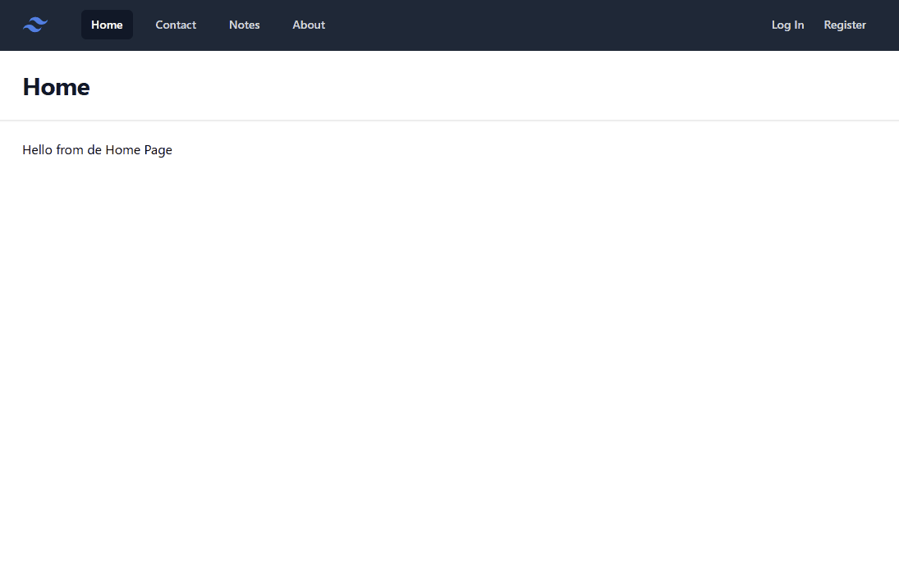

# 21. Flash messages

En esta 21ª lección, vamos a ver cómo mostrar mensajes flash en nuestra aplicación. Los mensajes flash son mensajes que se muestran al usuario después de realizar una acción, como por ejemplo, después de enviar un formulario. Estos mensajes se muestran una sola vez, y se eliminan después de ser mostrados.

### Recursos

- [AlpineJS](https://alpinejs.dev/)

## Flash Messages

Los mensajes flash son mensajes que se muestran al usuario después de realizar una acción, como por ejemplo, después de enviar un formulario. Esta información debe ser almacenada dentro de la sesión, ya que queremos recuperarla en la siguiente petición, y una vez mostrada, eliminarla.

Para poder incorporar un mensaje flash en nuestra aplicación, podemos utilizar el método `with` de la clase `RedirectResponse`. Este método recibe dos parámetros, el primero es el nombre del mensaje, y el segundo es el mensaje en sí.

```php
use Illuminate\Http\RedirectResponse;

return redirect('/home')->with('status', 'Profile updated!');
```

También podemos utilizar rutas con nombre, y pasar el mensaje como segundo parámetro.

```php
use Illuminate\Http\RedirectResponse;

return redirect()->route('home')->with('status', 'Profile updated!');
```

Se pueden utilizar cualquier clave, por ejemplo `success`, `error`, `warning`, etc. Y para recuperar el mensaje en la vista, podemos utilizar el método `session` de la clase `Request`.

```php
@if (session('status'))
    <div class="alert alert-success">
        {{ session('status') }}
    </div>
@endif
```

## Crear un componente para mensajes flash

La idea de partida es crear un componente que se encargue de mostrar los mensajes flash, y este componente "Padre" se encargue de mostrar otros compoenentes hijos.

La idea es tener un componente específicos para cada tipo de mensaje, por ejemplo, `success`, `error`, `warining`, etc, y estos componentes se muestren dentro del componente padre. ¿Cuando se mostrará cada componente? Pues dependerá del tipo de mensaje que se haya enviado, y esto lo podemos saber si existe una clave en la sesión con ese nombre. Para esto podemos utilizar el método `has` de la clase `Session`.

```php
@if (session()->has('status'))
    //hacer algo
@endif
```

Laravel nos proporciona una directiva llamada `@session` que es más corta donde solo ponemos `@session('status')` con la clave que queremos utilizar, y nos devuelve si existe o no. Después para obtener el mensaje vinculado a esa clave, utilizamos la función helper `session('status')`.

En base a esto, vamos a crear un componente llamado `flash-message.blade` que se encargue de mostrar los mensajes flash, los vamos a crear en la carpeta `resources/views/components`. También vamos a crear mensajes individuales para cada tipo de mensaje, `success`, `error`, `warning`, etc. Estos componentes para mensajes los vamos a crear dentro de la carpeta `resources/views/components/alerts`, con los nombres `alerts\success.blade.php`, `alerts\error.blade.php`, `alerts\warning.blade.php`, `alerts\info.blade.php`.

### Componentes individuales

**resources/views/components/flash-message.blade.php**

```php
<div class="relative min-w-32">
  <div class="absolute top-10 right-12">
    <div x-data="{show: true}" x-show="show" x-init="setTimeout(() => show=false, 3000)">
      @session('success')
      <x-alerts.success :message="session('success')"/>
      @endsession

      @session('error')
      <x-alerts.error :message="session('error')"/>
      @endsession

      @session('info')
      <x-alerts.info :message="session('info')"/>
      @endsession

      @session('warning')
      <x-alerts.warning :message="session('warning')"/>
      @endsession
    </div>
  </div>
</div>
```

Como se puede apreciar, hemos utilizado la directiva `@session` para comprobar si existe un mensaje con esa clave, y después hemos utilizado el componente `x-alerts.{clave}` para mostrar el mensaje. Este componente recibe un parámetro llamado `message` que es el mensaje que queremos mostrar.

Indicamos que se posicione de forma absoluta en la parte superior derecha, y que se muestre durante 3 segundos, y después se oculte. Este tema de mostrar y ocultar lo hemos hecho con AlpineJS, que es un framework de JavaScript que nos permite añadir interactividad a nuestras aplicaciones. (más adelante veremos más sobre AlpineJS).

Ahora vamos a crear los componentes para los mensajes individuales. Cada componente tendrá un icono, un mensaje y un botón para cerrar el mensaje. Para el mensaje, indicamos que el componente reciba un parámetro llamado `message` que es el mensaje que queremos mostrar.

Al presionar el botón de cerrar, el mensaje se ocultará. Para esto, hemos utilizado la directiva `@click` de AlpineJS, que nos permite ejecutar una función cuando se hace clic en un elemento.

Todos los componentes son iguales, lo única que cambia son los colores utilizados.

**resources/views/components/alerts/success.blade.php**

```php
@props(['message' => ''])

<div class="rounded-md bg-green-50 p-4">
  <div class="flex">
    <div class="flex-shrink-0">
      <svg class="h-5 w-5 text-green-400" viewBox="0 0 20 20" fill="currentColor" aria-hidden="true">
        <path fill-rule="evenodd" d="M10 18a8 8 0 100-16 8 8 0 000 16zm3.857-9.809a.75.75 0 00-1.214-.882l-3.483 4.79-1.88-1.88a.75.75 0 10-1.06 1.061l2.5 2.5a.75.75 0 001.137-.089l4-5.5z" clip-rule="evenodd" />
      </svg>
    </div>
    <div class="ml-3">
      <p class="text-sm font-medium text-green-800">{{$message}}</p>
    </div>
    <div class="ml-auto pl-3">
      <div class="-mx-1.5 -my-1.5">
        <button @click="show=false" type="button" class="inline-flex rounded-md bg-green-50 p-1.5 text-green-500 hover:bg-green-100 focus:outline-none focus:ring-2 focus:ring-green-600 focus:ring-offset-2 focus:ring-offset-green-50">
          <span class="sr-only">Dismiss</span>
          <svg class="h-5 w-5" viewBox="0 0 20 20" fill="currentColor" aria-hidden="true">
            <path d="M6.28 5.22a.75.75 0 00-1.06 1.06L8.94 10l-3.72 3.72a.75.75 0 101.06 1.06L10 11.06l3.72 3.72a.75.75 0 101.06-1.06L11.06 10l3.72-3.72a.75.75 0 00-1.06-1.06L10 8.94 6.28 5.22z" />
          </svg>
        </button>
      </div>
    </div>
  </div>
</div>
```

**resources/views/components/alerts/error.blade.php**

```php
@props(['message' => ''])

<div>
  <div class="rounded-md bg-red-50 p-4">
    <div class="flex">
      <div class="flex-shrink-0">
        <svg class="h-5 w-5 text-red-400" viewBox="0 0 20 20" fill="currentColor" aria-hidden="true">
          <path fill-rule="evenodd"
                d="M10 18a8 8 0 100-16 8 8 0 000 16zM8.28 7.22a.75.75 0 00-1.06 1.06L8.94 10l-1.72 1.72a.75.75 0 101.06 1.06L10 11.06l1.72 1.72a.75.75 0 101.06-1.06L11.06 10l1.72-1.72a.75.75 0 00-1.06-1.06L10 8.94 8.28 7.22z"
                clip-rule="evenodd"/>
        </svg>
      </div>
      <div class="ml-3">
        <p class="text-sm font-medium text-red-800">{{$message}}</p>
      </div>
      <div class="ml-auto pl-3">
        <div class="-mx-1.5 -my-1.5">
          <button @click="show=false" type="button"
                  class="inline-flex rounded-md bg-red-50 p-1.5 text-red-400 hover:bg-red-100 focus:outline-none focus:ring-2 focus:ring-red-600 focus:ring-offset-2 focus:ring-offset-red-50">
            <span class="sr-only">Dismiss</span>
            <svg class="h-5 w-5" viewBox="0 0 20 20" fill="currentColor" aria-hidden="true">
              <path
                d="M6.28 5.22a.75.75 0 00-1.06 1.06L8.94 10l-3.72 3.72a.75.75 0 101.06 1.06L10 11.06l3.72 3.72a.75.75 0 101.06-1.06L11.06 10l3.72-3.72a.75.75 0 00-1.06-1.06L10 8.94 6.28 5.22z"/>
            </svg>
          </button>
        </div>
      </div>
    </div>
  </div>
</div>
```

**resources/views/components/alerts/warning.blade.php**

```php
@props(['message' => ''])

<div class="rounded-md bg-green-50 p-4">
  <div class="flex">
    <div class="flex-shrink-0">
      <svg class="h-5 w-5 text-yellow-400" viewBox="0 0 20 20" fill="currentColor" aria-hidden="true">
        <path fill-rule="evenodd" d="M10 18a8 8 0 100-16 8 8 0 000 16zm3.857-9.809a.75.75 0 00-1.214-.882l-3.483 4.79-1.88-1.88a.75.75 0 10-1.06 1.061l2.5 2.5a.75.75 0 001.137-.089l4-5.5z" clip-rule="evenodd" />
      </svg>
    </div>
    <div class="ml-3">
      <p class="text-sm font-medium text-yellow-800">{{$message}}</p>
    </div>
    <div class="ml-auto pl-3">
      <div class="-mx-1.5 -my-1.5">
        <button @click="show=false" type="button" class="inline-flex rounded-md bg-yellow-50 p-1.5 text-yellow-500 hover:bg-yellow-100 focus:outline-none focus:ring-2 focus:ring-yellow-600 focus:ring-offset-2 focus:ring-offset-yellow-50">
          <span class="sr-only">Dismiss</span>
          <svg class="h-5 w-5" viewBox="0 0 20 20" fill="currentColor" aria-hidden="true">
            <path d="M6.28 5.22a.75.75 0 00-1.06 1.06L8.94 10l-3.72 3.72a.75.75 0 101.06 1.06L10 11.06l3.72 3.72a.75.75 0 101.06-1.06L11.06 10l3.72-3.72a.75.75 0 00-1.06-1.06L10 8.94 6.28 5.22z" />
          </svg>
        </button>
      </div>
    </div>
  </div>
</div>
```

**resources/views/components/alerts/info.blade.php**

```php
@props(['message' => ''])


<div class="rounded-md bg-green-50 p-4">
  <div class="flex">
    <div class="flex-shrink-0">
      <svg class="h-5 w-5 text-blue-400" viewBox="0 0 20 20" fill="currentColor" aria-hidden="true">
        <path fill-rule="evenodd" d="M10 18a8 8 0 100-16 8 8 0 000 16zm3.857-9.809a.75.75 0 00-1.214-.882l-3.483 4.79-1.88-1.88a.75.75 0 10-1.06 1.061l2.5 2.5a.75.75 0 001.137-.089l4-5.5z" clip-rule="evenodd" />
      </svg>
    </div>
    <div class="ml-3">
      <p class="text-sm font-medium text-blue-800">{{$message}}</p>
    </div>
    <div class="ml-auto pl-3">
      <div class="-mx-1.5 -my-1.5">
        <button @click="show=false" type="button" class="inline-flex rounded-md bg-blue-50 p-1.5 text-blue-500 hover:bg-blue-100 focus:outline-none focus:ring-2 focus:ring-blue-600 focus:ring-offset-2 focus:ring-offset-blue-50">
          <span class="sr-only">Dismiss</span>
          <svg class="h-5 w-5" viewBox="0 0 20 20" fill="currentColor" aria-hidden="true">
            <path d="M6.28 5.22a.75.75 0 00-1.06 1.06L8.94 10l-3.72 3.72a.75.75 0 101.06 1.06L10 11.06l3.72 3.72a.75.75 0 101.06-1.06L11.06 10l3.72-3.72a.75.75 0 00-1.06-1.06L10 8.94 6.28 5.22z" />
          </svg>
        </button>
      </div>
    </div>
  </div>
</div>
```

### Utilizar el componente en la vista

Ahora simplemente tenemos que incluir el componente `flash-message` en nuestra vista, y automáticamente se mostrarán los mensajes flash. El componente que hemos utilizado para el diseño de todas las vistas es `components/layout.blade.php`, pues simplemente en cualquier posición del layout, podemos incluir el componente `<x-flash-message />`.

```php
// resources/views/components/layout.blade.php
 <main>
    <x-flash-message/>
    <div class="mx-auto max-w-7xl px-4 py-6 sm:px-6 lg:px-8">
      {{ $slot }}
    </div>
  </main>
```


### Mostrar el mensaje

Para mostrar el mensaje simplemente tenemos que crear un mensaje flash en la sesión, y atomáticamente se mostrará en la vista.

Vamos a crear mensajes flash, para las acciones más importantes de nuestra aplicación, como por ejemplo, cuando se crea una nota, cuando se actualiza una nota, o cuando se elimina una nota, también cuando un usuario se loga o se registras, etc.

Por ejemplo,en el controlador de notas, agregamos mensajes para las acciones de crear, actualizar y eliminar una nota.

```php
public function store(Request $request)
{
   //resto código
    
   return redirect()->route('notes.index')->with('success', 'Note created successfully!');
}

public function update(Request $request, Note $note)
{
    //resto código

    return redirect()->route('notes.index')->with('success', 'Note updated successfully!');
}

public function destroy(Note $note)
{
    //resto código

    return redirect()->route('notes.index')->with('success', 'Note deleted successfully!');
}
```

Ahora haz lo mismo para el controlador de usuarios, y agrega mensajes flash para las acciones de login y registro.

Por ejemplo, al iniciar sesión, `Welcome back! {user-name}`, y al registrarse, `Welcome {user-name}!`, y para el logout, `Goodbye {user-name}!`. Para el logint, registro y logout, vamos a utilizar mensajes de tipo `info`.


Aplica todos estos cambios en tu aplicación, y comprueba que los mensajes flash se muestran correctamente en la vista.

El resultado final debería ser algo similar a esto:




## AlpineJS

AlpineJS es un framework de JavaScript que nos permite añadir interactividad a nuestras aplicaciones. Es muy ligero, y no requiere de compilación, por lo que es muy fácil de añadir a nuestra aplicación.

Alpine combina genial con PHP, ya que nos permite agregar interactividad de forma muy sencilla, sin tener que escribir prácticamente ningún código JavaScript. Utiliza una sintaxis muy simple, con atributos personalizados de HTML que comienzan igual que Laravel, con un prefijo `x-`. Para ver más sobre AlpineJS, puedes visitar su [documentación](https://alpinejs.dev/).

En nuestro ejemplo de mensajes flash, hemos utilizado AlpineJS para mostrar y ocultar los mensajes. Hemos utilizado las directivas `x-data`, `x-show` y `x-init` para mostrar el mensaje durante 3 segundos, y después ocultarlo.

**x-data**: Se utiliza para inicializar una variable en AlpineJS. En nuestro caso, hemos utilizado un objeto que contiene una propiedad `show` que inicializamos a `true`. Por defecto, el mensaje se muestra.

**x-show**: Se utiliza para mostrar u ocultar un elemento en función de una condición. En nuestro caso, hemos utilizado `x-show="show"`, lo que significa que el mensaje se muestra si la propiedad `show` es `true`, y se oculta si es `false`.

**x-init**: Ejecuta código de inicialización. En nuestro caso un temporizador de 3 segundos, que después de ese tiempo, cambia la propiedad `show` a `false`, y el mensaje se oculta.

**@click**: Se utiliza para ejecutar una función cuando se hace clic en un elemento. En nuestro caso, hemos utilizado `@click="show=false"`, lo que significa que cuando se hace clic en el botón de cerrar, el mensaje se oculta.


De esta forma tan sencilla, hemos añadido interactividad a nuestra aplicación, sin tener que escribir prácticamente ningún código JavaScript.


### Agregar AlpineJS a nuestra aplicación

Para añadir AlpineJS a nuestra aplicación, simplemente tenemos que incluir el script de AlpineJS en nuestra plantilla principal. En nuestro caso, hemos añadido el script en el archivo `resources/views/components/layout.blade.php`.

Hemos agregado el script de AlpineJS junto con el de TailwindCSS.

```php
// resources/views/components/layout.blade.php
<head>
  <meta charset="UTF-8">
  <meta name="viewport" content="width=device-width, initial-scale=1">
  <script defer src="https://cdn.jsdelivr.net/npm/alpinejs@3.x.x/dist/cdn.min.js"></script>
  <script src="https://cdn.tailwindcss.com"></script>
  <title>Document</title>
</head>
```


